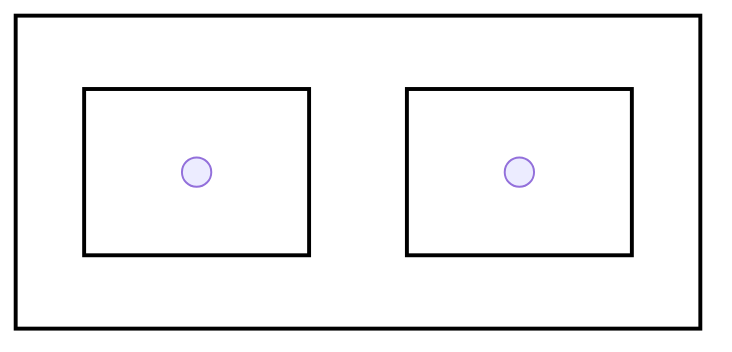

# 2026 年国家公务员录用考试
# 《行政职业能力测验》
# 行政执法

**重要提示：**

为维护您的个人权益，确保公务员考试的公平公正，请您协助我们监督考试实施工作。

本场考试规定：监考老师要向本考场全体考生展示题本密封情况，并邀请 2 名考生代表验封签字后，方能开启试卷袋。

---

NO_CONTENT_HERE

---

# 注 意 事 项

1. 行政职业能力测验共有六个部分，130 道题，总时限为 120 分钟。各部分不分别计时，但都给出了参考时限，供答题时参考。
2. 将姓名与准考证号在指定位置上用黑色字迹的钢笔、签字笔或圆珠笔填写，并用 2B 铅笔在准考证号对应的数字上填涂。
3. 请将题本上的条形码揭下，贴在答题卡指定位置。没有贴条形码的答题卡将按作废处理，成绩计为零分。
4. 题目应在答题卡上作答，在题本上作答一律无效。
5. 待监考老师宣布考试开始后，你才可以开始答题。
6. 监考老师宣布考试结束时，你应立即停止作答，将题本、答题卡和草稿纸都翻过来放在桌上，待监考老师确认数量无误、发出离开指令后，方可离开考场。
7. 试题答错不倒扣分。
8. 严禁折叠答题卡！

---

NO_CONTENT_HERE

---

# 第一部分 政治理论

（共 20 题，参考时限 20 分钟）

根据题目要求，在四个选项中选出一个正确答案。

**请开始答题：**

1. 习近平总书记强调，必须坚持自信自立。中国人民和中华民族从近代以后的深重苦难走向伟大复兴的光明前景，从来就没有教科书，更没有现成答案。关于坚持自信自立，下列表述正确的有几项（ ）
   ①走自己的路，是党的全部理论和实践立足点，更是党百年奋斗得出的历史结论
   ②推进中国式现代化，必须坚持把国家和民族发展放在自己力量的基点上
   ③中国式现代化既要物质财富极大丰富，也要精神财富极大丰富、在思想文化上自信自强
   ④独立自主是中华民族的优良传统，是中国共产党、中华人民共和国立党立国的重要原则
   A. 4 项
   B. 3 项
   C. 2 项
   D. 1 项

1. A

【解析】本题考查政治理论。
①项，习近平总书记在庆祝中国共产党成立 100 周年大会上明确指出，走自己的路，是党的全部理论和实践立足点，更是党百年奋斗得出的历史结论。我们党在革命、建设、改革各时期，正是坚持走自己的路，才取得了一系列伟大成就；
②项，习近平总书记强调推进中国式现代化，必须坚持独立自主、自立自强，坚持把国家和民族发展放在自己力量的基点上，把我国发展进步的命运牢牢掌握在自己手中。这是中国式现代化不依附外部力量、稳步推进的核心保障；
③项，党的二十大报告中明确中国式现代化是物质文明和精神文明相协调的现代化。其崇高追求是既要物质富足，也要精神富有，既要物质财富极大丰富，也要精神财富极大丰富、在思想文化上自信自强；
④项，习近平总书记明确强调，独立自主是中华民族的优良传统，是中国共产党、中华人民共和国立党立国的重要原则。这一原则贯穿党和国家发展始终，是抵御外部干扰、坚持自身发展道路的重要根基。
故正确答案为 A。

~ 1 ~

---

2. 习近平总书记强调，科学制定和接续实施五年规划，是我们党治国理政一条重要经验，也是中国特色社会主义一个重要政治优势。关于五年规划编制工作，下列说法正确的是（ ）
    A. 从第一个五年计划到当前的五年规划，一以贯之的主题是把我国建设成为社会主义现代化国家
    B. 通过互联网就“十五五”规划编制向全社会征求意见和建议，在我国五年规划编制史上是第一次
    C. 我国五年规划（计划）编制工作起始于 1949 年，有力推动了经济社会发展、综合国力提升、人民生活改善
    D. 中长期发展规划有助于充分发挥政府在资源配置中的决定性作用，彰显了政府对经济社会发展的宏观调控能力

2. A

【解析】本题考查政治理论。
*   A 项，2025 年 6 月，第 12 期《求是》杂志发表习近平重要文章《用中长期规划指导经济社会发展是我们党治国理政的一种重要方式》习近平总书记明确指出，从第一个五年计划到第十四个五年规划，一以贯之的主题是把我国建设成为社会主义现代化国家。多年来，每一轮五年规划的制定实施，都是围绕这一核心主题推进，逐步朝着社会主义现代化国家目标迈进；
*   B 项，我国五年规划编制史上，首次通过互联网向全社会征求意见和建议的是“十四五”规划编制，并非“十五五”规划。2020 年建言“十四五”规划编制的网络专栏上线，这是首次借助互联网开展规划意见征集的实践；
*   C 项，我国从 1951 年着手编制第一个五年计划，1953 年开始实施，并非起始于 1949 年。1955 年 7 月，一届全国人大二次会议正式审议并通过“一五”计划，此后的五年规划（计划）才持续推动经济社会等多方面发展；
*   D 项，我国社会主义市场经济体制中，市场在资源配置中起决定性作用，政府的作用是更好发挥宏观调控职能。中长期发展规划的作用是为市场运行和政府调控提供指引，而非强化政府在资源配置中的决定性作用，该选项混淆了市场与政府的核心职能定位。

故正确答案为 A。

3. 建设文化强国，事关中国式现代化建设全局，事关中华民族复兴大业，事关提升国际竞争

~ 2 ~

---

力、锚定 2035 年社会主义文化强国的战略目标，必须始终坚持文化建设着眼于人、落脚于人，下列有关说法正确的是：（  ）

①文化强国之“强”最终要体现在为人民提供文化服务和文化产品的能力上

②坚持以人民为中心，着眼满足人民群众多样化、多层次、多方面的精神文化需求

③文化创造核心在人，要建设一支规模宏大、结构合理、锐意创新的高水平文化人才队伍

④尊重人才成长规律，完善符合文化领域特点的人才选拔、培养、使用、激励机制，营造识才、重才、爱才的良好政策环境

A. ①②④
B. ①③④
C. ②③④
D. ①②③

<mark>3. C</mark>

【解析】本题考查政治理论。

①项，根据《求是》第八期《加快建设文化强国》指出：“第三，始终坚持文化建设着眼于人、落脚于人。文化强国之“强”最终要体现在人民的思想境界、精神状态、文化修养上。”

②项，根据《求是》第八期《加快建设文化强国》指出：“要坚持以人民为中心，着眼满足人民群众多样化、多层次、多方面的精神文化需求，提升文化服务和文化产品供给能力，增强人民群众文化获得感、幸福感。”

③项，根据《求是》第八期《加快建设文化强国》指出：“文化创造核心在人。要把育人才、建队伍作为重要而紧迫的战略任务，统筹各类人才培养，建设一支规模宏大、结构合理、锐意创新的高水平文化人才队伍。”

④项，根据《求是》第八期《加快建设文化强国》指出：“要尊重人才成长规律，建立健全科学权威、公开透明的文艺和学术评价体系，完善符合文化领域特点的人才选拔、培养、使用、激励机制，营造识才、重才、爱才的良好政策环境。”

故正确答案为 C。

4. 中共中央、国务院印发《加快建设农业强国规划（2024-2035 年）》，提出面对新形势新要求，必须把加快建设农业强国作为统领“三农”工作的战略总纲，摆上建设社会主义现代化强国的重要位置。下列与加快建设农业强国有关的说法正确的是（  ）

A. 推进农业科技推广体系，从经营性向公益性转变

B. 推进生态综合补偿，健全横向生态保护补偿机制，统筹推进生态环境损害赔偿

~ 3 ~

---

C. 完善粮食产销奖补制度，中央预算内投资向粮食主销区倾斜
D. 建立健全长江流域信息共享系统，推进长江流域农业深度节水控水

4. B

【解析】本题考查政治理论。

A 项，“健全公益性和经营性相结合的农业科技推广体系，加强基层农技推广队伍建设。”这里明确说明是“公益性和经营性相结合”，而不是“从经营性向公益性转变”；

B 项，绿色低碳、彰显底色，牢固树立绿水青山就是金山银山的理念，加快形成绿色低碳生产生活方式，让绿色循环、低碳发展成为农业强国的鲜明底色。这表明农业强国建设重视生态保护，而“健全横向生态保护补偿机制”是生态保护中的常见政策概念。虽然文章中没有直接提到“横向生态保护补偿机制”，但提到了“统筹建立粮食产销区省际横向利益补偿机制”，这表明“横向补偿机制”是规划中的一个政策方向。此外，“生态综合补偿”和“生态环境损害赔偿”是生态保护领域的常见概念，与“绿色低碳”的理念相符。因此，选项 B 的表述与农业强国规划的精神相符；

C 项，文章中明确提到：健全粮食主产区利益补偿机制，完善产粮大县奖补制度，中央预算内投资向粮食主产区倾斜，省级统筹的土地出让收入可按规定用于粮食主产区的高标准农田建设、现代种业提升等，统筹建立粮食产销区省际横向利益补偿机制。这里明确说明是“向粮食主产区倾斜”，而不是“向粮食主销区倾斜”；

D 项，文章中并没有关于“长江流域信息共享系统”或“长江流域农业深度节水控水”的明确提及。虽然文章中提到“发展优质节水高产饲草生产”，但未明确提及长江流域。

故正确答案为 B。

5. 全面推进依法治国是一个系统工程，必须坚持法治国家、法治政府、法治社会一体建设。下列相关表述不准确的是（ ）

A. 法治社会是构筑法治国家、法治政府的基础
B. 法治国家是依法治国的主体，是法治社会建设的先导和示范
C. 法治政府、法治社会建设必须服从、服务于法治国家建设
D. 建设法治政府对建设法治社会具有重要引领和带动作用

5. B

【解析】本题考查政治理论。

~ 4 ~

---

<mark>A 项，法治社会是构筑法治国家、法治政府的基础。法治社会的核心是全社会成员普遍形成法治意识、自觉遵守法律规范，只有夯实这一基础，法治政府的依法行政、法治国家的整体建设才能获得广泛的群众支撑和社会认同，这是三者关系的基本定位；</mark>

<mark>B 项，法治政府是建设法治国家的主体，同时，法治政府是法治社会建设的先导和示范，而不是法治国家；</mark>

<mark>C 项，法治国家是法治政府、法治社会建设的目标，法治政府、法治社会建设必须服从、服务于法治国家建设；</mark>

<mark>D 项，建设法治政府对法治社会具有重要引领和带动作用。政府是法律法规的主要执行者，其严格规范公正文明的执法行为，能为社会公众树立鲜明的法治标杆，带动全社会形成尊法学法守法用法的良好风尚，是连接法治国家与法治社会的关键桥梁。</mark>

<mark>故正确答案为 B。</mark>

6. 2025 年 7 月，习近平总书记在中央城市工作会议上发表重要讲话，明确做好城市工作的总体要求、重要原则、重点任务，为做好新时代新征程的城市工作提供了根本遵循。关于城市工作，下列说法正确的是（ ）

 A. 城市工作重心应向更加注重建设投入转变

 B. 着力通过外延扩张发展组团式的现代化城市群和都市圈

 C. 城市政府应从城市事务管理的“掌舵人”转变为“划桨人”

 D. 要把握“我国城镇化正从快速增长期转向稳定发展期”的历史方位

<mark>6. D</mark>

<mark>【解析】本题考查政治理论。2025 年 7 月，习近平总书记在中央城市工作会议上发表重要讲话会议指出，我国城镇化正从快速增长期转向稳定发展期，城市发展正从大规模增量扩张阶段转向存量提质增效为主的阶段。城市工作要深刻把握、主动适应形势变化：①转变城市发展理念，更加注重以人为本；②转变城市发展方式，更加注重集约高效；③转变城市发展动力，更加注重特色发展；④转变城市工作重心，更加注重治理投入；⑤转变城市工作方法，更加注重统筹协调。</mark>

<mark>A 项，会议明确城市发展从“规模扩张”阶段转向“存量提质增效为主”，强调内涵式发展，而非单纯增加建设投入；</mark>

<mark>B 项，外延扩张式发展已被摒弃，会议提出以城市更新为抓手优化结构“转变城市发展方式，更加注重集约高效”，而非发展组团式城市群；</mark>

~ 5 ~

---

C 项，“掌舵人”负责把握方向、制定规则，而“划桨人”是执行者。会议强调政府需通过政策引导和市场、社会力量协同治理，避免大包大揽。要求政府从“城市管理”转向“城市治理”，政府应作为“掌舵人”引导多元主体参与，而非是直接参与的“划桨人”；

D 项，该会议明确我国城市发展已进入以存量提质增效为主的新阶段，为新时代城市工作提供了根本遵循，需通过更新行动提升质量，符合“存量提质增效”的总体要求。

故正确答案为 D。

7．下列相关说法不准确的是（ ）
A．要加快推动作为经济增长和就业收入基本依托的传统产业升级
B．要加快补上内需，特别是消费短板，使内需成为拉动经济增长的主动力和稳定锚
C．要坚持以量取胜，充分发挥规模效应，用好超大规模市场优势和丰富应用场景
D．要用好各类增量资源和存量资源，通过清理存量，以带动增量

7．C
【解析】本题考查政治理论。要坚持以质取胜和发挥规模效应相统一，用好超大规模市场和丰富应用场景优势，培育更多世界一流企业和领先技术，把质的有效提升和量的合理增长统一于高质量发展的全过程。
故正确答案为 C。

8．下列关于民生保障工作表述不正确的是（ ）
A．巩固拓展脱贫攻坚成果，确保不发生规模性返贫致贫
B．夯实三农基础，推动粮食和主要农产品价格保持在合理水平
C．实施就业优先政策导向，促进高校毕业生，退役军人，农民工等群体重点就业
D．始终把人民群众财产安全放在第一位，加强安全生产监督

8．D
【解析】本题考查政治理论。习近平总书记指出，始终把人民群众生命安全放在第一位，而不是财产安全，所以 D 项表述不正确。
故正确答案为 D。

9．关于做好新时代人口工作，下列说法正确的是（ ）
A．要树立“大人口观”，推动人口与财政、货币、就业、产业、投资、消费、生态、区域等政策形成系统集成效应
B．必须推动人口工作由注重总量，畅通流动自调节数量，优化结构转变
C．要更加重视“引导”和“激励”的办法，由社会治理向政府治理转变
D．坚持人民主体地位，把人口高速增长同人民高品质生活紧密结合起来

~ 6 ~

---

9. A

【解析】本题考查政治理论。

* A 项，在新时代人口工作中，树立“大人口观”具有重要意义。人口发展并非孤立存在，而是与经济社会的各个方面紧密相连。将人口政策与财政、货币、就业、产业、投资、消费、生态、区域等政策有机结合起来，能够形成政策合力，实现系统集成效应。
* B 项，完整表述应该是必须推动人口工作由注重数量、增速、总量，向重视均衡、品质、系统、包容、可持续、高质量发展转变。原选项表述不完整、不准确，不能清晰体现新时代人口工作转变的方向和重点。
* C 项，新时代人口工作强调形成政府、社会、企业、个人等多主体共同参与的治理格局，实现多元共治。要更加重视“引导”和“激励”的办法，是从政府主导的治理模式向政府、社会等多主体协同治理转变，而不是由社会治理向政府治理转变。社会治理强调多方参与，政府治理侧重于政府的主导作用，人口工作需要各方共同发挥作用。
* D 项，我国人口发展已经进入新常态，人口增速放缓是人口发展的客观规律。当前人口工作的重点不是追求人口高速增长，而是提高人口素质、优化人口结构、促进人口长期均衡发展，将人口质量提升与人民高品质生活紧密结合起来。

故正确答案为 A。

10. 《中共中央关于制定国民经济和社会发展第十五个五年规划的建议》提出，推进国家安全体系和能力现代化，建设更高水平平安中国。下列有关说法正确的是（ ）

A. 锻造实践使用的国家安全能力，把捍卫国土安全摆在首位
B. 统筹推进房地产、地方政府债务、中小金融机构等风险有序化解
C. 健全国家安全体系，坚持以风险防控为先导，法治保障为落脚点
D. 完善公共安全体系，推动公共安全治理由事后处理向事中控制转型

10. B

【解析】本题考查政治理论。

* A 项：国家安全体系中，政治安全是根本，需“把维护政治安全摆在首位”。国土安全是国家安全的重要组成部分，但并非首要优先级；
* B 项：《“十五”规划建议》明确提出“统筹发展和安全，有效防范化解重点领域风险”，其中房地产、地方政府债务、中小金融机构风险是当前经济领域最突出的系统性风险点，属于“重点领域风险有序化解”的核心内容；
* C 项：健全国家安全体系需坚持“人民安全为宗旨、政治安全为根本、国家利益至上为

~ 7 ~

---

准则”，风险防控是重要手段，法治保障是重要支撑，但并非“以风险防控为先导，法治保障为落脚点”；

D 项：完善公共安全体系需“推动公共安全治理模式向事前预防转型，促进社会治理和公共安全治理水平明显提高。”而非“由事后处理向事中控制转型”。

故正确答案为 B。

11. 习近平总书记高度重视战略思维，多次强调党员领导干部要加强战略思维，增强战略定力，下列体现战略思维的说法正确的有几项？（ ）

①粮食多一点少一点是战略问题，粮食安全是战术问题

②统战工作的本质要求是大团结大联合，解决的是人心和力量问题

③要心怀“国之大者”，站在全局和战略的高度想问题、办事情，一切工作都要以贯彻落实党中央决策部署为前提

④自觉把党的对外工作放到党和国家工作大局中来认识，放到中国与世界关系的发展变化中来把握

A. 1 项  
B. 2 项  
C. 3 项  
D. 4 项

**11. C**

**【解析】**本题考查政治理论。

①项，错误，习近平总书记在 2020 年 12 月的中央农村工作会议上明确指出，粮食多一点少一点是战术问题，粮食安全是战略问题。该说法颠倒了战术问题和战略问题的对应关系；

②项，2015 年 5 月，习近平总书记在中央统战工作会议上指出，统战工作的本质要求是大团结大联合，解决的就是人心和力量问题，这是党治国理政必须花大心思、下大气力解决好的重大战略问题。统战工作关乎治国理政全局，其相关论述体现了战略思维；

③项，习近平总书记在《心怀“国之大者”，切实把增强“四个意识”、坚定“四个自信”、做到“两个维护”落到行动上》一文中明确提出，要求领导干部要心怀“国之大者”，站在全局和战略的高度想问题、办事情，一切工作都要以贯彻落实党中央决策部署为前提；

④项，习近平总书记在谈到外交工作时指出，要自觉把党的对外工作放到党和国家工作

~ 8 ~

---

大局中来认识，放到中国与世界关系的发展变化中来把握，放到国家总体外交的战略部署中来谋划。这体现了将党的对外工作融入全局的战略考量，符合战略思维的要求。

故正确答案为 C。

12. 习近平总书记指出，我们要建成的教育强国，是中国特色社会主义教育强国、应当具有强大的思政引领力、人才竞争力、科技支撑力、民生保障力、社会协同力、国际影响力，为以中国式现代化全面推进强国建设、民族复兴伟业提供有力支撑。关于建设教育强国，下列说法正确的是（ ）
    A. 要坚持教育均等化原则，把教育公平作为国家基本教育政策
    B. 要完善人才培养与经济社会发展需要适配机制，顺应时代发展要求，适度增加学科专业数量
    C. 要把引进全球顶尖科学家摆到更加突出位置，着力培育拔尖创新人才，推动实现高水平科技自立自强
    D. 从教育大国到教育强国是一个系统性跃升和质变，必须以改革创新为动力

12. D

【解析】本题考查政治理论。
*   A 项，习近平 2018 年 9 月 10 日在全国教育大会上的讲话指出，我们要坚持我国教育现代化的社会主义方向，坚持教育公益性原则，把教育公平作为国家基本教育政策，大力推进教育体制改革创新；
*   B 项，习近平 2024 年 9 月 9 日在全国教育大会上的讲话指出，要完善人才培养与经济社会发展需要适配机制，顺应时代发展要求，动态调整学科专业，优化办学资源配置，完善学生实习实践制度，努力让每一位人才都能人尽其才、才尽其用、各得其所；
*   C 项，习近平 2024 年 9 月 9 日在全国教育大会上的讲话指出，要把培养国家重大战略急需人才摆到更加突出位置，着力造就拔尖创新人才，推动实现高水平科技自立自强；
*   D 项，习近平在中共中央政治局第五次集体学习时强调，加快建设教育强国，为中华民族伟大复兴提供有力支撑，从教育大国到教育强国是一个系统性跃升和质变，必须以改革创新为动力。

故正确答案为 D。

13. 习近平主席在二十国集团领导人第十九次峰会上指出，要完善全球贸易治理，建设开放型世界经济。下列相关表述正确的是（ ）

~ 9 ~

---

A．要适应经济问题政治化的潮流，通过强化绿色低碳要求推行贸易保护政策
B．要积极构建更具平等性、包容性和建设性的产业链供应链伙伴关系，呼吁各方加强合作
C．要把安全置于国际经贸议程中心地位，持续推动贸易和投资自由化便利化
D．要一以贯之保持世界贸易组织规则不变，提高多边贸易体制的权威性、有效性和相关性

13. B

【解析】本题考查政治理论。2024 年 11 月 18 日，国家主席习近平在二十国集团领导人第十九次峰会（G20 里约热内卢峰会）上发表题为《携手共建开放型世界经济》的重要讲话。讲话中的“第三，完善全球贸易治理，建设开放型世界经济”中指出，要把发展置于国际经贸议程中心地位，持续推动贸易和投资自由化便利化，要继续推进世界贸易组织改革，反对单边主义、保护主义，推动争端解决机制尽快恢复正常运转，并将《促进发展的投资便利化协定》纳入世界贸易组织规则框架，早日就电子商务协定达成一致。要积极推进世界贸易组织规则与时俱进，既要解决长期未决议题，又要积极探索制定面向未来的新规则，提高多边贸易体制的权威性、有效性和相关性。要避免经济问题政治化、人为割裂全球市场，避免以绿色低碳为名、行保护主义之实。两年前，中国同印度尼西亚等国共同发起《产业链供应链韧性与稳定国际合作倡议》，呼吁构建更具平等性、包容性和建设性的产业链供应链伙伴关系，我们愿同各方就此加强合作。故 A 项要“避免”经济问题政治化、“避免”以绿色低碳为名、行保护主义之实；C 项要把“发展”置于国际经贸议程中心地位，而不是“安全”；D 项要要积极推进世界贸易组织规则“与时俱进”，而不是“一以贯之”。
故正确答案为 B。

14. 中国式现代化要靠科技现代化作支撑，实现高质量发展要靠科技创新培育新动能。关于建成科技强国的举措，下列说法正确的是（ ）
A．要坚持有所为有所不为，突出经济发展需求，在重要领域实施科技战略部署
B．要充分发挥人才在科技资源配置中的决定性作用，调动产学研各环节的积极性
C．要降低基础研究组织化程度，强化自由探索，鼓励面向重大科学问题的协同攻关
D．要充分发挥科技领军企业龙头作用，鼓励中小企业和民营企业科技创新，支持企业牵头或参与国家重大科技项目

~ 10 ~

---

14．D

【解析】本题考查政治理论。

A 项，2024 年，习近平在全国科技大会、国家科学技术奖励大会、两院院士大会上指出：“要保持战略定力，坚持有所为有所不为，突出国家战略需求，在若干重要领域实施科技战略部署，凝练实施一批新的重大科技项目，形成竞争优势，赢得战略主动”；

B 项，2024 年，习近平在全国科技大会、国家科学技术奖励大会、两院院士大会上指出：“要充分发挥市场在科技资源配置中的决定性作用，更好发挥政府各方面作用，调动产学研各环节的积极性，形成共促关键核心技术攻关的工作格局”；

C 项，2024 年，习近平在全国科技大会、国家科学技术奖励大会、两院院士大会上指出：“要提高基础研究组织化程度，完善竞争性支持和稳定支持相结合的投入机制，强化面向重大科学问题的协同攻关，同时鼓励自由探索，努力提出原创基础理论、掌握底层技术原理，筑牢科技创新根基和底座”；

D 项，2024 年，习近平在全国科技大会、国家科学技术奖励大会、两院院士大会上指出：“要充分发挥科技领军企业龙头作用，鼓励中小企业和民营企业科技创新，支持企业牵头或参与国家重大科技项目”。

故正确答案为 D。

15．习近平总书记强调，选人用人要加强党性鉴别，注重考察干部的境界格局和忠诚度廉洁度。下列与党性相关的说法正确的是（ ）

A．党性、党风、党纪是有机整体，党性是根本，党风是保障，党纪是表现

B．作风问题本质上是党性问题，要把作风建设摆在党性修养的首位

C．树立和践行正确政绩观，起决定性作用的是党性

D．强党性，就是要自觉用马克思主义思想改造客观世界

15．C

【解析】本题考查政治理论。

A 项，《习近平 2024 年 12 月 16 日在纪念乔石同志诞辰 100 周年座谈会上的讲话》中指出：党性、党风、党纪是有机整体，党性是根本，党风是表现，党纪是保障。我们要始终坚持党的全面领导和党中央集中统一领导，坚定不移全面从严治党，深入推进党风廉政建设和反腐败斗争，永葆党的先进性和纯洁性，确保党始终成为中国特色社会主义事业的坚强领导核心；

~ 11 ~

---

B 项，2024 年 12 月，习近平总书记在主持召开中央政治局民主生活会时强调，“领导干部要把锤炼党性、提高思想觉悟作为终身课题，活到老、学到老、修养到老。要把政治修养摆在党性修养的首位，从党的创新理论中汲取党性滋养，把学习遵守贯彻党章党规党纪作为党性修养的重要内容”；

C 项，习近平总书记在 2022 年春季学期中央党校（国家行政学院）中青年干部培训班开班式上强调：“树立和践行正确政绩观，起决定性作用的是党性。”党性是党员干部立身、立业、立言、立德的基石；

D 项，习近平总书记在学习贯彻习近平新时代中国特色社会主义思想主题教育工作会议上指出，强党性，就是要自觉用新时代中国特色社会主义思想改造主观世界，深刻领会这一思想关于坚定理想信念、提升思想境界、加强党性锻炼等一系列要求，始终保持共产党人的政治本色。

故正确答案为 B。

16. 坚持问题导向是习近平新时代中国特色社会主义思想的世界观和方法论的重要内容。关于坚持问题导向，下列说法不准确的是（ ）

A. 坚持问题导向是马克思主义的鲜明特点

B. 坚持问题导向要抓住人民最关心最直接最现实的利益问题

C. 坚持问题导向体现了矛盾的普遍性和客观性

D. 坚持问题导向本质是变与不变、继承与发展的辩证统一

16. D

【解析】本题考查政治理论。

A 项，2016 年 5 月，习近平在哲学社会科学工作座谈会上指出：“坚持问题导向是马克思主义的鲜明特点。”这一重要论述，指明了坚持问题导向的理论根据；

B 项，习近平指出：“人民立场是马克思主义政党的根本政治立场，人民是历史进步的真正动力，群众是真正的英雄，人民利益是我们党一切工作的根本出发点和落脚点。”人民立场从根本上决定了我们党坚持问题导向的根本价值指向和鲜明特质在于为人民谋幸福。坚持问题导向，就要倾听人民呼声、回应人民期待，特别是要解决好群众最关心最直接最现实的利益问题，用真招、实招解决困扰人民群众的急难愁盼问题；

C 项，2015 年 1 月 23 日，习近平总书记在十八届中央政治局第二十次集体学习时强调：

~ 12 ~

---

“问题是事物矛盾的表现形式，我们强调增强问题意识、坚持问题导向，就是承认矛盾的普遍性、客观性，就是要善于把认识和化解矛盾作为打开工作局面的突破口”；

D 项，守正和创新相辅相成，体现了“变”与“不变”、继承与发展、原则性与创造性的辩证统一。

<mark>故正确答案为 D。</mark>

17．恩格斯深刻指出：“马克思的整个世界观不是教义，而是方法。它提供的不是现成的教条，而是进一步研究的出发点和供这种研究使用的方法。”下列有关马克思主义理论的说法不准确的是（ ）
A．《共产党宣言》发表至今，人类社会发生了翻天覆地的变化，但马克思主义所阐述的一般原理整个来说仍然是完全正确的
B．马克思创立了辩证法，成为我们认识世界和改造世界的根本方法
C．当代中国的伟大社会变革不是简单套用马克思主义经典作家设想的模板
D．科学社会主义的原则不能丢，但科学社会主义也绝不是一成不变的教条

<mark>17．B</mark>

<mark>【解析】</mark>本题考查政治理论。

<mark>A 项，马克思主义的一般原理（如生产力与生产关系的矛盾运动、阶级斗争理论等）揭示了人类社会发展的普遍规律，具有科学性和普遍性。《共产党宣言》作为马克思主义诞生的标志，其基本原理至今仍能指导实践；</mark>

<mark>B 项，辩证法并非马克思“创立”，而是人类认识史上长期发展的成果（如黑格尔的唯心辩证法）。马克思的贡献是批判继承了黑格尔辩证法的合理内核，将其与唯物主义结合，创立了“唯物辩证法”，成为认识和改造世界的根本方法；</mark>

<mark>C 项，当代中国的社会变革（如中国特色社会主义道路）是马克思主义基本原理与中国具体实际相结合的产物，并非机械套用经典作家的设想（如马克思设想的共产主义是在资本主义高度发达基础上实现）；</mark>

<mark>D 项，科学社会主义的基本原则（如生产资料公有制、人民当家作主等）是根本遵循，不能丢；但同时要结合时代特征和具体国情不断丰富发展（如中国特色社会主义是科学社会主义的新形态），反对教条主义。</mark>

<mark>故正确答案为 B。</mark>

18．以实践为基础，从整体上把握人与世界的关系，是马克思主义世界观的重要内容。关于马克思主义实践观，下列说法正确的是（ ）

~ 13 ~

---

A. 实践是一种无目的的适应环境的本能活动
B. 正确发挥主观能动性是实践的根本途径
C. 实践的过程就是对于结果的检验和评价
D. 实践是人类生存和发展最基本的活动

<mark>18. D</mark>

<mark>【解析】</mark>本题考查政治理论

<mark>A 项，</mark>马克思主义实践观强调实践是人类有意识、有目的的改造世界的物质性活动，不是本能活动；

<mark>B 项，</mark>实践的根本途径是“物质性活动”，不是“正确发挥主观能动性”，主观能动性的发挥必须建立在尊重客观规律的基础上，但实践的根本属性是客观物质性；

<mark>C 项，</mark>实践包含检验认识的真理性，但实践过程不仅是检验和评价结果，还包括改造世界的目的性活动；

<mark>D 项，</mark>马克思主义实践观强调，生产实践是人类最基本的实践活动，决定其他一切活动。

故正确答案为 D。

19. 习近平总书记在对各省区市进行深入考察调研的过程中，结合各地实际情况，对推进高质量发展作出一系列重要部署。下列对应关系正确的是（ ）
A. 贵州——聚焦实现贸易、投资、跨境资金流动、人员进出、运输来往自由便利和数据安全有序流动
B. 云南——要把握好挑大梁的着力点，在推动科技创新和产业创新融合上打头阵
C. 山东——要发挥海洋资源丰富的得天独厚优势，经略海洋、向海图强打造世界级海洋港口群，打造现代海洋经济发展高地
D. 江苏——要建设国家资源型经济转型综合配套改革试验区，重点抓好能源转型、产业升级和适度多元发展

<mark>19. C</mark>

<mark>【解析】</mark>本题考查政治理论。

<mark>A 项，2025 年 11 月 6 日</mark>习近平总书记在海南省三亚市听取海南自由贸易港建设工作汇报时强调，要认真学习贯彻党的二十届四中全会精神，在党中央集中统一领导下，各级各有关方面密切协作、主动作为，通过持续努力，全面实现海南自由贸易港建设目标。《海南自由贸易港建设总体方案》指出，自由便利是总体方案制度设计的关键

~ 14 ~

---

点，未来海南自由贸易港将在贸易、投资、跨境资金流动、人员进出等六个方面实现自由便利；

B 项，2025 年 3 月 5 日下午，习近平总书记在参加十四届全国人大三次会议江苏代表团审议时强调，经济大省要“在推动科技创新和产业创新融合上打头阵”，并提出四点要求：打头阵——强化科技创新与产业创新的双向奔赴，引领新质生产力发展；勇争先——推进深层次改革和高水平开放；走在前——落实国家重大发展战略；作示范——促进全体人民共同富裕；

C 项，2024 年 5 月 22 日至 24 日，习近平总书记先后来到山东省日照、济南等地进行调研，听取山东省委和省政府工作汇报并作重要讲话。习近平总书记强调，要发挥海洋资源丰富的得天独厚优势，经略海洋、向海图强，打造世界级海洋港口群，打造现代海洋经济发展高地；

D 项，2025 年 7 月 7 日至 8 日，习近平在阳泉、太原考察调研。8 日上午，习近平听取山西省委和省政府工作汇报，对山西各方面取得的成绩给予肯定，对下一步工作提出要求。习近平指出，建设国家资源型经济转型综合配套改革试验区是党中央交给山西的一项战略任务，要进一步统一思想，保持定力，坚定有序推进转型发展。重点要抓好能源转型、产业升级和适度多元发展。

故正确答案为 C。

20. 2025 年是中国人民抗日战争暨世界反法西斯战争胜利 80 周年。中国人民对战争带来的苦难有着刻骨铭心的记忆，对和平有着孜孜不倦的追求。关于中国人民抗日战争，下列表述不准确的是（ ）

A. 中国人民抗日战争的伟大胜利，第一次确立了中国在世界上的大国地位，使中国人民赢得了世界爱好和平人民的尊敬

B. 中国人民抗日战争的伟大胜利，是以爱国主义为核心的民族精神的伟大胜利

C. 中国人民抗日战争的伟大胜利，为中华民族由近代以来陷入深重危机走向伟大复兴确立了历史转折点

D. 中国人民抗日战争的伟大胜利，是近代以来中国抗击外敌入侵的第一次完全胜利

20. A

【解析】本题考查政治理论

A 项， 2025 年 9 月 1 日出版的第 17 期《求是》杂志发表重要文章《弘扬伟大抗战精神，向着中华民族伟大复兴的光辉彼岸奋勇前进》指出，中国人民抗日战争的伟大胜利，

~ 15 ~

---

重新确立了中国在世界上的大国地位，中国人民赢得了世界爱好和平人民的尊敬，中华民族赢得了崇高的民族声誉。这个伟大胜利，是中华民族从近代以来陷入深重危机走向伟大复兴的历史转折点、也是世界反法西斯战争胜利的重要组成部分，是中国人民的胜利、也是世界人民的胜利。而不是第一次确立；

B 项，2025 年 9 月 1 日出版的第 17 期《求是》杂志发表重要文章《弘扬伟大抗战精神，向着中华民族伟大复兴的光辉彼岸奋勇前进》指出，中国人民抗日战争胜利是以爱国主义为核心的民族精神的伟大胜利；

C 项，2025 年 9 月 1 日出版的第 17 期《求是》杂志发表重要文章《弘扬伟大抗战精神，向着中华民族伟大复兴的光辉彼岸奋勇前进》指出，这个伟大胜利，是中华民族从近代以来陷入深重危机走向伟大复兴的历史转折点、也是世界反法西斯战争胜利的重要组成部分，是中国人民的胜利、也是世界人民的胜利；

D 项，2025 年 9 月 1 日出版的第 17 期《求是》杂志发表重要文章《弘扬伟大抗战精神，向着中华民族伟大复兴的光辉彼岸奋勇前进》指出，中国人民抗日战争胜利，是近代以来中国抗击外敌入侵的第一次完全胜利。

故正确答案为 A。

# 第二部分 常识判断

（共 15 题，参考时限 10 分钟）

根据题目要求，在四个选项中选出一个正确答案。

请开始答题：

21．下列情形不符合《中华人民共和国监察法》及其实施条例规定的是（  ）
* A．在派出的监察专员王某在开展监察工作过程中，受派出他的监察机构领导
* B．公务员张某在怀孕期间因涉嫌严重职务违法被监察机关调查，经监察机关依法审批，对其采取责令候查措施
* C．监察人员李某涉嫌职务犯罪，监察机关决定对其采取 15 日禁闭措施
* D．办理监察事项的监察人员黄某系监察对象刘某的丈夫，黄某应自行回避

21．C

【解析】本题考查法律常识。

A 项，根据《中华人民共和国监察法实施条例》第十四条的规定，经国家监察委员会批准

~ 16 ~

---

再派出的监察机构、监察专员，其开展监察工作需受派出它的监察机构、监察专员领导；

B 项，根据《中华人民共和国监察法》第二十三条的规定，被调查人涉嫌严重职务违法或者职务犯罪，且符合留置条件，但患有严重疾病、生活不能自理的，系怀孕或者正在哺乳自己婴儿的妇女，或者生活不能自理的人的唯一扶养人，经监察机关依法审批，可以采取责令候查措施；

C 项，根据《中华人民共和国监察法》第六十四条的规定，监察人员涉嫌严重职务违法或者职务犯罪，监察机关经依法审批可以对其采取禁闭措施，但禁闭期限不得超过七日；

D 项，根据《中华人民共和国监察法》第五十八条的规定，办理监察事项的监察人员有下列情形之一的，应当自行回避，监察对象、检举人及其他有关人员也有权要求其回避：（一）是监察对象或者检举人的近亲属的；（二）担任过本案的证人的；（三）本人或者其近亲属与办理的监察事项有利害关系的；（四）有可能影响监察事项公正处理的其他情形的。

故正确答案为 C。

22. 关于《中华人民共和国民营经济促进法》，下列说法错误的是（ ）
A. 是我国第一部专门关于民营经济发展的基础性法律
B. 规定司法行政部门建立涉企行政执法诉求沟通机制
C. 规定向民营经济组织开放国家重大科研基础设施
D. 规定地方各级人民政府与民营经济组织订立的合同不得变更

22. D

【解析】本题考查政治理论。

A 项，《中华人民共和国民营经济促进法》是我国第一部专门针对民营经济发展的基础性法律，填补了此前在民营经济领域缺乏系统性法律规范的空白。该法以法律形式确立了民营经济在社会主义市场经济中的重要地位，为民营经济的健康发展提供了全面、稳定的制度框架，是构建高水平社会主义市场经济体制的重要法律支撑；

B 项，根据《中华人民共和国民营经济促进法》第五十三条的规定，各级政府及部门需建立行政执法违法行为投诉举报处理机制，及时受理并依法处理企业投诉，保护民企合法权益。司法行政部门还需建立涉企行政执法诉求沟通机制，开展执法检查和监督，纠正不当执法行为；

C 项，根据《中华人民共和国民营经济促进法》第二十八条的规定，支持民营经济组织参

~ 17 ~

---

与国家科技攻关项目，支持有能力的民营经济组织牵头承担国家重大技术攻关任务，向民营经济组织开放国家重大科研基础设施，支持公共研究开发平台、共性技术平台开放共享，为民营经济组织技术创新平等提供服务，鼓励各类企业和高等学校、科研院所、职业学校与民营经济组织创新合作机制，开展技术交流和成果转移转化，推动产学研深度融合；

D 项，根据《中华人民共和国民营经济促进法》第七十条的规定，地方各级人民政府及其有关部门应当履行依法向民营经济组织作出的政策承诺和与民营经济组织订立的合同，不得以行政区划调整、政府换届、机构或者职能调整以及相关人员更替等为由违约、毁约。因国家利益、社会公共利益需要改变政策承诺、合同约定的，应当依照法定权限和程序进行，并对民营经济组织因此受到的损失予以补偿。

故正确答案为 D。

23. 根据《中华人民共和国反洗钱法》，下列说法错误的是（ ）
A. 在我国境内设立的非银行支付机构应履行该法规定的金融机构反洗钱
B. 我国境内宝石现货交易应当及时向反洗钱监测分析机构报告
C. 在业务关系结束后，金融机构应将客户身份资料至少保存十年
D. 出入境人员携带的现金超过规定金额的，应当按照规定向海关申报

23. B

【解析】本题考查法律常识。

A 项，根据《中华人民共和国反洗钱法》第六十三条规定，在境内设立的下列机构，履行本法规定的金融机构反洗钱义务：（一）银行业、证券基金期货业、保险业、信托业金融机构；（二）非银行支付机构；（三）国务院反洗钱行政主管部门确定并公布的其他从事金融业务的机构；

B 项，根据《中华人民共和国反洗钱法》第六条规定在中华人民共和国境内（以下简称境内）设立的金融机构和依照本法规定应当履行反洗钱义务的特定非金融机构，应当依法采取预防、监控措施，建立健全反洗钱内部控制制度，履行客户尽职调查、客户身份资料和交易记录保存、大额交易和可疑交易报告、反洗钱特别预防措施等反洗钱义务。我国境内宝石现货交易的交易商，属于本法规定的履行反洗钱义务主体。我国境内宝石现货交易中，单笔或日累计现金交易金额达到 10 万元人民币（含）或等值外币时，必须在交易发生后 5 个工作日内向中国反洗钱监测分析中心提交大额交易报告；

~ 18 ~

---

<mark>C 项，根据《中华人民共和国反洗钱法》第三十四条规定，金融机构应当按照规定建立客户身份资料和交易记录保存制度。在业务关系存续期间，客户身份信息发生变更的，应当及时更新。客户身份资料在业务关系结束后、客户交易信息在交易结束后，应当至少保存十年；</mark>

<mark>D 项，根据《中华人民共和国反洗钱法》第十八条规定，出入境人员携带的现金、无记名支付凭证等超过规定金额的，应当按照规定向海关申报。</mark>

<mark>故正确答案为 B。</mark>

24. 甲乙系夫妻关系。甲盗窃他人 3 万元人民币后回家告诉了乙，要其帮忙联系去外地朋友家“躲几天风头”。对此，下列说法正确的是（ ）
    A. 若乙为甲盗窃案的证人，在人民法院通知其出庭作证时可以拒绝
    B. 由于甲乙为夫妻，即使乙帮助甲逃匿，其行为也不构成犯罪
    C. 若甲逃匿后公安机关联系到乙，乙陪同甲至公安机关投案、甲不构成自首
    D. 若甲最终被判处刑罚，乙可以不经过甲的同意直接提出上诉

<mark>24. A</mark>

<mark>【解析】本题考查法律常识。</mark>

<mark>A 项，根据《中华人民共和国刑事诉讼法》第 188 条：“经人民法院通知，证人没有正当理由不出庭作证的，人民法院可以强制其到庭，但是被告人的配偶、父母、子女除外。”；</mark>

<mark>B 项，根据《中华人民共和国刑法》第 310 条：“明知是犯罪的人而为其提供隐藏处所、财物，帮助其逃匿或者作假证明包庇的，处三年以下有期徒刑、拘役或者管制……”夫妻关系不构成豁免，乙的行为可能构成窝藏、包庇罪；</mark>

<mark>C 项，根据《关于处理自首和立功具体应用法律若干问题的解释》：“自动投案，是指犯罪事实或者犯罪嫌疑人未被司法机关发觉，或者虽被发觉，但犯罪嫌疑人尚未受到讯问、未被采取强制措施时，主动、直接向公安机关、人民检察院或者人民法院投案。”若甲在乙陪同下主动投案，且如实供述，可能构成自首；</mark>

<mark>D 项，根据《中华人民共和国刑事诉讼法》第 227 条：“被告人的辩护人和近亲属，经被告人同意，可以提出上诉。”乙作为近亲属，必须经甲同意才能上诉。</mark>

<mark>故正确答案为 A。</mark>

25. 下列说法与我国税收制度不相符的是（ ）
    A. 对我国境内某全球知名半导体公司征收增值税

~ 19 ~

---

B．对未做废弃物无害化处理的养殖场征收资源税
C．对某进口高档化妆品公司征收消费税
D．对在我国境内外资企业工作多年的外籍居民征收个人所得税

<mark>25．B</mark>

<mark>【解析】</mark>本题考查经济常识。

*   <mark>A 项</mark>，根据《中华人民共和国增值税法》第三条，在我国境内销售货物的单位为增值税纳税人。半导体公司的核心业务是销售半导体相关货物，属于增值税的应税范围，因此对其征收增值税符合我国税收制度；
*   <mark>B 项</mark>，依据《中华人民共和国资源税法》，资源税的征税对象是在我国领域及管辖海域开发的应税资源，具体范围为《资源税税目税率表》中的矿产品、盐、水气矿产等。养殖场未做废弃物无害化处理，应当征收的是环境保护税；
*   <mark>C 项</mark>，财政部和国家税务总局发布的《关于调整化妆品消费税政策的通知》明确，高档化妆品属于消费税的征收范围，进口环节同样需缴纳消费税，税率为 15%。所以对进口高档化妆品的公司征收消费税，符合我国消费税相关规定；
*   <mark>D 项</mark>，《中华人民共和国个人所得税法》及实施条例规定，在中国境内无住所但一个纳税年度内居住累计满 183 天的个人为居民个人，居民个人需就境内外所得缴纳个人所得税。在境内外资企业工作多年的外籍居民，显然满足居民个人的判定条件，因此对其征收个人所得税符合我国税收制度。

故正确答案为 B。

26．下列有关说法错误的是（ ）
A．利簋是“铜铁炉中翻火焰”时代留下的器物
B．在“只几个石头磨过”时，人类学会了用火
C．“更陈王奋起挥黄钺”揭开了秦末农民起义的序幕
D．成汤建立商朝是“五帝三皇神圣事”之一

<mark>26．D</mark>

<mark>【解析】</mark>本题考查人文常识。

*   <mark>A 项</mark>，“铜铁炉中翻火焰”出自毛泽东《贺新郎·读史》，特指青铜器时代和铁器时代。而利簋是西周早期的青铜器，是武王伐纣后官员“利”受赏青铜所铸，它的铸造正体现了青铜器时代的冶炼与铸造工艺，恰好对应诗句中所描述的青铜器时代这一范畴；

~ 20 ~

---

B 项，人类用火甚至早于“仅磨几个石头”的简单石器时代，学会人工取火还和打制石器的行为有关。考古发现显示，80 万—60 万年前北京周口店的直立人就已能控制火，南非奇迹洞穴更是有 100 万年前古人类主动生火的证据，这些时期人类所用的多是打制而成的简单石器。而后来人类学会人工取火，也源于制造石器的过程——打制石头时碰撞产生的火花常引燃易燃物，古人经长期观察实践，慢慢掌握了击石取火这一最早的人工取火方法；

C 项，“更陈王奋起挥黄钺”出自毛泽东《贺新郎·读史》，“陈王”即陈胜，“挥黄钺”象征他举兵反秦的壮举；

D 项，三皇五帝是夏朝建立前的上古部落联盟首领（如黄帝、炎帝、尧、舜等），而成汤（商汤）是夏朝之后商朝的开国君主，不属于“三皇五帝”范畴，二者分属不同历史时期，身份也截然不同（前者是部落联盟领袖，后者是王朝开国帝王）。

故正确答案为 D。

27. 2025 年 3 月中共中央办公厅、国务院办公厅印发《逐步把永久基本农田建成高标准农田实施方案》，下列有关说法正确的是（ ）

A. 西北区要重点加强水平梯田改造建设

B. 25 度以上坡耕地、沿海内陆滩涂是开展建设的重点

C. 高标准农田建设标准中的“两通”是指通水通路

D. 黄淮海区应该把改善田块细碎化问题作为一个工作重点

27. C

【解析】本题考查政治理论。

A 项，《方案》建设分区中指出：西北区包括山西、陕西、甘肃、宁夏、新疆（含新疆生产建设兵团）5 省（自治区），以及内蒙古中西部 8 盟（市），重点加强田块整治，提高农业用水效率，破解“卡脖子”问题；

B 项，《方案》建设布局中指出：严格限制在生态脆弱区、沿海内陆滩涂等区域，禁止在 25 度以上坡耕地、严格管控类耕地、生态保护红线（红线内集中连片梯田或与保护对象共生的连片耕地除外）、退耕还林还草还湖还牧区域等开展高标准农田建设；

C 项，《方案》建设标准中指出：以“一平”（田块平整）、“两通”（通水通路）、“三提升”（提升地力、产量、效益）为基本标准，合理确定不同区域、不同类型高标准农田建设标准和投入标准；

D 项，《方案》建设分区中指出：黄淮海区包括北京、天津、河北、山东、河南 5 省（直

~ 21 ~

---

辖市），重点着力提高灌溉保证率，完善现代化耕作条件。东南区包括浙江、福建、广东、海南 4 省，重点在尊重农民意愿前提下逐步改善田块细碎化问题，增强农田防御暴雨能力。

故正确答案为 C。

28．“体重管理年”三年行动旨在引导全社会养成重视体重、科学饮食与锻炼的习惯，科学减重，健康生活。关于肥胖对健康的影响，下列说法错误的是（ ）
A．肥胖容易引发胰岛素抵抗，增加患 2 型糖尿病风险
B．内脏脂肪组织分泌的炎症因子与动脉粥样硬化发展相关
C．肥胖者的排尿次数多，会导致血尿酸水平远低于正常人
D．肥胖引起的气道狭窄可能诱发阻塞性睡眠呼吸暂停

28．C
【解析】本题考查科技常识。
A 项，肥胖会降低身体对胰岛素的敏感性，引发胰岛素抵抗，长期可诱发 2 型糖尿病，肥胖是胰岛素抵抗和 2 型糖尿病的重要危险因素；
B 项，内脏脂肪组织在肥胖状态下会分泌大量促炎因子（如 TNF α、IL-6），这些因子可直接损伤血管内皮细胞，诱导内皮炎症反应，促进动脉粥样硬化斑块形成；
C 项，肥胖者通常伴随胰岛素抵抗、肾脏尿酸排泄减少等因素，导致高尿酸血症，而不是“血尿酸水平远低于正常人”。排尿次数多不一定直接降低血尿酸，且肥胖者常见高血尿酸；
D 项，肥胖可引起上气道周围脂肪沉积，导致睡眠时气道狭窄，发生阻塞性睡眠呼吸暂停。
故正确答案为 C。

29．下列与自然界的颜色有关的说法，错误的是（ ）
A．橙色月亮通常发生在大气层中水汽或颗粒物质较多时
B．蓝莓呈现靛蓝色是因为表面蜡质层中含有高浓度花青素
C．火烈鸟羽毛呈现朱红色与摄入食物中的虾青素积累有关
D．蓝闪蝶翅膀呈蓝色是由于其表面鳞片具有特殊的微结构

29．B
【解析】本题考查科技常识。
A 项，月亮本身不发光，依赖反射太阳光。当大气层中水汽、尘埃、颗粒物较多时（如雾

~ 22 ~

---

霾、火山灰、日出或日落时段），太阳光中的短波光线（蓝、紫光）被大气散射，长波光线（橙、红光）穿透性更强，使月亮呈现橙色（极端情况为红色“血月”）；

<mark>B 项，蓝莓的靛蓝色来自细胞内液泡中的花青素（水溶性色素），而非“表面蜡质层”。</mark>蓝莓表面的蜡质层（果粉）是白色半透明的脂质结构，作用是防止水分流失、抵御微生物，不含花青素；花青素作为水溶性色素，必须存在于细胞液泡中才能稳定存在，无法附着在蜡质层（脂溶性环境）；

C 项，火烈鸟的羽毛本色为白色，其朱红色来自食物中的虾青素（类胡萝卜素）。火烈鸟以藻类、甲壳类（如磷虾）为食，这些生物含有的虾青素无法被火烈鸟消化分解，会沉积在羽毛、皮肤和脂肪中，使羽毛逐渐呈现从粉红到朱红的颜色（食物中虾青素含量越高，颜色越鲜艳）；

D 项，翅膀鳞片表面有纳米级的脊状结构，能通过光的干涉、衍射作用，反射太阳光中的蓝光，吸收其他波长的光线，从而呈现明亮的蓝色（即使翅膀磨损，结构被破坏，蓝色会消失，而色素色不会因磨损轻易褪去）。

故正确答案为 B。

30．为促进长江水生生物多样性和水域生态修复，我国实施长江十年禁渔。下列相关说法错误的是（ ）
A．长江流域“一江一口两湖七河”禁渔，“两湖”指鄱阳湖和太湖
B．禁止在长江流域开放水域养殖外来物种或者其他非本地物种
C．青、草、鲢、鳙四大家鱼会在长江和其附属湖泊之间洄游
D．在禁渔期内使用炸鱼、电鱼等方式捕捞，涉嫌刑事犯罪

30．A

【解析】本题考查政治常识。

A 项，长江禁渔实施“十年禁渔”政策，自 2021 年 1 月 1 日起，覆盖“一江一口两湖七河”等重点水域。“一江”即长江干流；“一口”指长江口；“两湖”为鄱阳湖和洞庭湖；“七河”包含岷江、沱江、赤水河、嘉陵江、乌江、汉江和大渡河。“一江一口两湖七河”中的“两湖”指鄱阳湖和洞庭湖，而非太湖。

B 项，2024 年 3 月，《国务院办公厅关于坚定不移推进长江十年禁渔工作的意见》（以下简称“意见”）发布，“意见”中“（十四）加强外来物种防治。开展外来物种常态化监测和预警，强化跨境、跨区域外来物种入侵信息跟踪和分析预警。有关地方要指导养殖主体加强水生外来物种水产养殖环节管理和风险防控，依法依规建立防逃隔

~ 23 ~

---

<mark>离设施，防止养殖外来物种逃逸。建立健全包括源头预防、监测预警、治理修复在内的全链条防控预案，推进水生外来入侵物种综合治理。加强外来物种入侵防控科普宣传，规范民间、宗教放生（放流）活动，严禁向天然开放水域放流外来物种、人工杂交种及其他不符合生态要求的水生生物。”</mark>

<mark>C 项，青、草、鲢、鳙四大家鱼确实具有洄游习性，这一习性在长江流域的生态系统中尤为显著。四大家鱼会在长江干流与其附属湖泊（如洞庭湖、鄱阳湖）之间进行周期性迁移。这种洄游行为主要与繁殖需求相关，亲鱼会从湖泊或支流洄游至长江干流产卵，幼鱼再随水流返回湖泊育肥。洄游习性促进了基因交流，维持了种群多样性，同时通过幼鱼在湖泊中的育肥过程，形成了长江流域特有的“鱼米共生”生态链。</mark>

<mark>D 项，2020 年 12 月 17 日，最高人民法院、最高人民检察院、公安部、农业农村部联合印发《依法惩治长江流域非法捕捞等违法犯罪的意见》（以下简称“意见”），“意见”的第二部分“二、准确适用法律，依法严惩非法捕捞等危害水生生物资源的各类违法犯罪”规定了“（一）依法严惩非法捕捞犯罪。违反保护水产资源法规，在长江流域重点水域非法捕捞水产品，具有下列情形之一的，依照刑法第三百四十条的规定，以非法捕捞水产品罪定罪处罚：1. 非法捕捞水产品五百公斤以上或者一万元以上的；2. 非法捕捞具有重要经济价值的水生动物苗种、怀卵亲体或者在水产种质资源保护区内捕捞水产品五十公斤以上或者一千元以上的；3. 在禁捕区域使用电鱼、毒鱼、炸鱼等严重破坏渔业资源的禁用方法捕捞的；4. 在禁捕区域使用农业农村部规定的禁用工具捕捞的；5. 其他情节严重的情形。”</mark>

故正确答案为 A。

31. 关于汽车自动驾驶技术，下列说法错误的是（ ）

 A. 激光雷达通过发射激光束来探测目标的位置、速度

 B. 相对于毫米波雷达，超声波雷达更适合远距离探测

 C. 强化学习有助于实现车辆的自主学习和智能决策

 D. 陀螺仪和加速度计可用来测算车辆的姿态和运动信息

**31. B**

<mark>【解析】本题考查科技常识。①超声波雷达：利用声波反射原理，探测距离短（通常 0.1-3 米）、精度高，抗干扰能力弱（受天气、障碍物材质影响大），适合「近距离场景」（如倒车入库、自动泊车时的障碍物检测）；②毫米波雷达：利用毫米波频段（24GHz/77GHz）</mark>

~ 24 ~

---

电磁波，探测距离远（通常 10-200 米）、抗干扰强（不受雨雪、大雾影响），适合「中远距离场景」（如高速巡航时的前车距离保持）；

故正确答案为 B。

33．某物流公司要优化长三角到乌鲁木齐的货物运输路线，下列最可行的是（ ）
A．夏季采用陇海—兰新铁路运输利用沿线低温天气自然保鲜
B．冬季选择长江—京杭大运河—黄河水运组合避开陆路交通拥堵
C．全年优先使用连霍高速公路运输以追求最低的运输成本
D．春秋季采用铁路冷藏集装箱运输平衡运输成本与时效性

33．D
【解析】本题考查科技常识。

A 项，①气候常识错误：陇海—兰新铁路沿线（甘肃、新疆段）属于温带大陆性气候，夏季炎热干燥，白天气温常达 30-40℃（如吐鲁番盆地夏季极端高温超 40℃），无“低温天气”；②自然保鲜逻辑矛盾：高温环境会加速易腐货物变质，反而需要冷藏设备，而非依赖自然低温，原解析违背区域气候常识；

B 项，①季节限制：冬季黄河下游、京杭大运河北段（山东、河北段）会结冰封航，水运完全中断；②路线合理性：长三角到乌鲁木齐走水运需经长江→京杭大运河→黄河，路线迂回曲折，距离超 5000 公里，运输时效极慢（比铁路慢 2-3 倍），且无法直达新疆（需转陆路），完全不符合物流优化需求；

C 项，①成本逻辑错误：连霍高速公路为长途公路运输，单位货物运输成本（元/吨·公里）是铁路的 2-3 倍，远高于铁路，无法实现“最低运输成本”；②长途适用性：公路运输适合中短途（≤1000 公里），长三角到乌鲁木齐（约 4000 公里）长途运输中，公路的油耗、过路费、损耗成本均高于铁路，且时效性无优势（铁路直达，公路需中途休整）；

D 项，①季节适配：春秋季全国气温适宜（西北内陆昼夜温差适中），无需应对夏季高温或冬季严寒的极端天气，运输环境稳定；②运输方式优势：铁路运输成本低于公路/航空，时效性高于水运，冷藏集装箱可精准控制温度（适配易腐货物），完美平衡“成本控制”与“时效性”；③路线合理性：陇海—兰新铁路（连霍铁路）是长三角到乌鲁木齐的核心铁路干线，直达性强、运输稳定，符合物流优化需求。

故正确答案为 D。

~ 25 ~

---

34．某款创意始终要用不同符号替代表盘上的数字，下列设计不合适的是（ ）
* A．用 45 度角的正弦“Sin45°”替代“1”
* B．用重力加速度“g”替代“10”
* C．用 3 的阶乘“3！”替代“6”
* D．用二进制数(1100)2替代“12”

<mark>34．A</mark>

<mark>【解析】本题考查科技常识。</mark>
<mark>A 项，Sin45°的物理数值为 $\sqrt{2}/2 \approx 0.707$，与要替代的数字“1”相差极大，数值不匹配，无法实现表盘数字的标识功能；</mark>
<mark>B 项，标准重力加速度 g=9.80665 m/s²，通常在实际计算中取近似值 9.8 m/s² 或 10 m/s²，在中学物理或工程估算中常取整为 10；</mark>
<mark>C 项，3!=3×2×1=6。要替代的数字正是 6；</mark>
<mark>D 项，(1100)2=1×2³+1×2²+0×2¹+0×2⁰=8+4=12。</mark>
<mark>故正确答案为 A。</mark>

35．某学院要制作一款与爱因斯坦有关的纪念手提袋，下列哪项不适合用作印刷图案（ ）
* A．F=ma
* B．光电效应
* C．E=mc²
* D．引力是时空弯曲的效应

<mark>35．A</mark>

<mark>【解析】本题考查科技常识。</mark>
<mark>A 项，「F=ma」是牛顿第二运动定律的核心表达式（艾萨克·牛顿提出），描述力（F）、质量（m）与加速度（a）的定量关系，属于经典力学体系，与爱因斯坦无关，因此不适合作为纪念图案；</mark>
<mark>B 项，爱因斯坦在 1905 年（“奇迹之年”）提出光量子假说，成功解释了光电效应（光照射金属表面释放电子的现象），该成果直接推动量子力学发展，也是他获得 1921 年诺贝尔物理学奖的核心依据，属于标志性贡献；</mark>
<mark>C 项，「E=mc²」是狭义相对论的质能等价公式（1905 年提出），揭示了质量（m）与能量（E）的本质关联（c 为真空中的光速），是爱因斯坦最具代表性的科学符号，全球认知度最高；</mark>
<mark>D 项，「引力是时空弯曲的效应」是广义相对论的核心结论（1915 年提出），爱因斯坦颠</mark>

~ 26 ~

---

覆了牛顿“万有引力是超距作用”的经典理论，认为引力本质是质量使时空发生弯曲的几何效应，是现代宇宙学的基础。

故正确答案为 A。

# 第三部分 言语理解与表达

（共 30 题，参考时限 30 分钟）

本部分包括表达与理解两方面的内容。请根据题目要求，在四个选项中选出一个最恰当的答案。

请开始答题：

36．在技术的赋能下，检察机关在办理公益诉讼案件时如同拥有了顺风耳、千里眼，不仅能有效避免“    ”式的线索摸排，也能有力确保证据的客观性和准确性，办案将更加精准、规范、高效，国家利益和社会公共利益将得到更好守护，公平正义也将更加可感可触。

填入画横线部分最恰当的一项是（ ）

A．刻舟求剑
B．管中窥豹
C．缘木求鱼
D．大海捞针

<mark>36．D</mark>

<mark>【解析】逻辑填空题。根据横线前“拥有顺风耳、千里眼”给了一个对策。横线要求填避免要填写一个问题，“顺风耳、千里眼”意味着能快速、准确地获取信息，那么要避免的应该是效率低下、难以找到目标的摸排方式。</mark>

<mark>A 项，“刻舟求剑”比喻死守教条、拘泥成法，不知变通。不能体现出效率低、难，排除；</mark>

<mark>B 项，“管中窥豹”比喻只看到事物的一小部分，侧重不全面，排除；</mark>

<mark>C 项，“缘木求鱼”比喻方向或方法完全错误，达不到目的，文段问题不是方法不对，排除；</mark>

<mark>D 项，“大海捞针”比喻极难找到、希望渺茫。能体现难，当选；</mark>

<mark>故正确答案为 D。</mark>

37．在太空实验室开展的脑电测试实验中，航天员戴的“小红帽”叫作脑电帽，里面嵌入了众多微小的触头，它们像一群    的小侦探，精准捕捉大脑每一个微妙的波动。这顶帽子赋予航天员神奇的能力——无须言语，无须动作，仅仅通过思维就能给电脑下指令，

~ 27 ~

---

操控各种设备。

填入画横线部分最恰当的项是：（ ）

A．未卜先知 [colspan=2] B．明察秋毫
C．洞若观火 [colspan=2] D．随机应变

**37．B**

<mark>【解析】</mark>逻辑填空题。横线前“像”比喻，所以横线要填的这个成语要符合喻体小侦探的特点。

A，“未卜先知”事前就预知，有预测未来的意思。文中没有“预测”功能，只是捕捉现有信号，排除；

B，“明察秋毫”形容目光敏锐，能看清极细微的东西。洞察一切，查证证据细节常用于法官等搭配，当选。

C，“洞若观火”形容观察事物非常清楚透彻，像看火一样。多指对情况、局势看得清楚，偏重于整体性的透彻了解。排除；

D，“随机应变”根据情况灵活应对。文中没有体现出“触头”会根据情况变化调整自身功能，只是被动或主动检测信号，排除。

故正确答案为 B。

**38．2024 年，我国脱贫县农民人均可支配收入增幅高于全国平均水平，脱贫人口务工就业规模保持稳中有增。2025 年是巩固拓展脱贫攻坚成果同乡村振兴有效衔接 5 年过渡期的最后一年，越是这个时候，越要扛稳责任，     ，做好监测帮扶工作。**

填入画横线部分最恰当的一项是（ ）

A．步步为营 [colspan=2] B．行稳致远
C．慎终如始 [colspan=2] D．绵绵用力

**38．C**

<mark>【解析】</mark>逻辑填空题。横线前说“2025 年是 5 年过渡期的最后一年，越是这个时候，越要扛稳责任”，说明横线要体现出，越到最后越要坚持到底，越要稳、谨慎。

A，“步步为营”比喻行动谨慎，稳扎稳打。只有谨慎体现不出最后一年的时间特点，排除；

B，“行稳致远”走得稳才能走得远。强调稳健与长远目标，但这里不是谈如何走远，而是如何收好尾。排除；

C，“慎终如始”在事情将要结束时仍然像开始时一样慎重，直接对应“最后一年”“越是这个时候”，强调收尾不松懈。当选；

~ 28 ~

---

<mark>D，“绵绵用力”持续用功，长久不懈。强调持续性和耐力，体现不出“最后一年”，排除；</mark>
<mark>故正确答案为 C。</mark>

39. 通用人工智能对重大情报的挖掘和精确预测，确实能够提高情报准确性，有利于减少误判；但有时也可能会使人类盲目自信，刺激其    。通用人工智能带来的进攻优势，导致最佳防御战略就是“    ”，这会打破进攻与防御的平衡，引发新型安全困境，反而增加了战争爆发的风险。
依次填入画横线部分最恰当的一项是（ ）
A. 孤注一掷 &emsp;&emsp;&emsp;&emsp; 避实击虚
B. 轻举妄动 &emsp;&emsp;&emsp;&emsp; 以攻为守
C. 刚愎自用 &emsp;&emsp;&emsp;&emsp; 攻其不备
D. 铤而走险 &emsp;&emsp;&emsp;&emsp; 先发制人

<mark>39. D</mark>
<mark>【解析】逻辑填空题。根据横线前，“使人类盲目自信，刺激其”这里有很明显的因果关系，横线要体现出盲目自信，导致人类怎么样。</mark>
<mark>A，“孤注一掷”比喻危机时投入全部力量放手一博，盲目自信不代表就到了最后关头，排除；</mark>
<mark>B，“轻举妄动”不经慎重考虑就轻率行动，符合因果关系，保留；</mark>
<mark>C，“刚愎自用”形容性格，这里要填写的是一个盲目自信的行动倾向，而不是性格描述，常见用法使他更加刚愎自用，排除；</mark>
<mark>D，“铤而走险”无路可走时采取冒险的行动，盲目自信会让他们更有把握，敢于冒险，保留；</mark>
<mark>第二空，根据空后“这会打破进攻与防御的平衡”“增加风险”说明因为人工智能平衡被打破了，我们是更主动的那一方且会伴随风险产生。</mark>
<mark>B，“以攻为守”用进攻作为防御的手段，但本质目的仍是防御，只是手段是进攻。不够主动，排除；</mark>
<mark>D，“先发制人”在对方尚未动手时，首先发动攻击制服对方，非常主动更容易“打破进攻与防御的平衡”。且先发制人容易因误判或抢先攻击而直接引发战争，因此风险更大。</mark>
<mark>当选</mark>
<mark>故正确答案为 D。</mark>

40. 面对技术突破催生的新产品和新服务，市场响应往往具有    。在层出不穷的技术供

~ 29 ~

---

给面前，市场选择是审慎、挑剔的，具有一定的随机性。对于一些技术虽然先进，但应用前景不明朗、难以迅速形成现金流的企业，市场通常会选择放弃。从这个角度看，瞪羚企业、独角兽企业都是经受住市场    的胜出者。

依次填入画横线部分最恰当的一项是（ ）

A．差异性 精挑细选
B．滞后性 大浪淘沙
C．被动性 优胜劣汰
D．模糊性 千锤百炼

**40．B**

<mark>【解析】</mark>逻辑填空题。第一空，根据空后“市场选择是审慎、挑剔的”以及“对于一些技术虽然先进，但应用前景不明朗……市场通常会选择放弃”，说明市场对于新出现的事物不一定会接受，说明市场对新产品和新服务的响应比较慢。

<mark>ACD 项</mark>，均和“慢”无关，排除；

<mark>B 项</mark>，“滞后性”可以体现响应慢的意思，当选。

<mark>故正确答案为 B。</mark>

41．把握动静之度是解决问题关键，过度求静易陷入消极怠慢、    的泥潭。在面对新问题时，往往会因为害怕承担责任或者担心打破现有秩序，一味地观望等待，致使问题越积越多。相反，过于求动、情况不明决心大则会让很多事情变得杂乱无章，往往    。

填入划横线部分最恰当的一项是（ ）

A．安于现状 分身乏术
B．裹足不前 措手不及
C．故步自封 事与愿违
D．自暴自弃 适得其反

**41．C**

<mark>【解析】</mark>逻辑填空题。第一空，和消极怠慢并列，体现不想解决问题之意。

<mark>A 项</mark>，“安于现状”指对当前状况习惯而不愿改变，符合文意，保留；

<mark>B 项</mark>，“裹足不前”比喻有所顾忌，不愿去做，并无“怠慢”之意，排除；

<mark>C 项</mark>，“故步自封”比喻守着老一套，不求进步，符合文意，保留；

<mark>D 项</mark>，“自暴自弃”指自己瞧不起自己，甘于落后或堕落，程度过重，排除。

第二空，体现过于求动、不清楚情况做决定导致的结果。

<mark>A 项</mark>，“分身乏术”核心语义指因客观条件限制无法同时兼顾多项事务，形容忙乱，不符合文意，排除；

<mark>C 项</mark>，“事与愿违”指事情的发展方向与主观愿望相违背，可以和前文“不清楚情况做决定”对应，当选。

<mark>故正确答案为 C。</mark>

~ 30 ~

---

42. 五彩滩是一处著名的雅丹地貌景观，位于新疆维吾尔自治区，中国唯一的一条注入北冰洋的河流额尔齐斯河穿行而过，南岸有绿洲、沙漠、蓝天，北岸则是    的泥岩、砂岩及砂砾组成的奇石怪岩。这两种    的地貌，竟能如此唇齿相依地遥相辉映，在落日夕阳照射下的岩石，呈现出五光十色，真是“一河隔两岸，胜似两重天”。
填入划横线部分最恰当的一项是（    ）
A. 千姿百态  别具一格
B. 绚丽多姿  各有千秋
C. 鳞次栉比  大相径庭
D. 色彩斑斓  截然不同

42. D
【解析】逻辑填空题。第一空，形容“沙砾及奇石怪岩”且呼应后文“在落日夕阳照射下的岩石，呈现出五光十色”，说明第一空要体现岩石颜色有很多之意。
A 项和 C 项，均和颜色无关，排除；
B 项和 D 项，均可以体现颜色多的意思，符合文意，保留。
第二空，根据空后解释“一河隔两岸，胜似两重天”，可知，横线处要体现两种地貌不同。
B 项，“各有千秋”比喻不同个体在同一层次内各具特色或长处，不符合文意，排除；
D 项，“截然不同”指两种事物界限分明、毫无共同之处，符合文意，当选。
故正确答案为 D。

43. 面对新的形势和要求，必须进一步全面深化改革，继续完善各方面的制度机制。因而，制度建设的任务更为繁重艰巨，加强顶层设计更为重要。如果不能全景式俯瞰和把握制度建设全局，采取总体构想和战略谋划，做到胸中有数，    地层层系统设计，难免顾此失彼、    ，无法取得制度建设的成效。
填入划横线部分最恰当的一项是（    ）
A. 循序渐进  进退维谷
B. 自上而下  左支右绌
C. 由表及里  得不偿失
D. 抽丝剥茧  捉襟见肘

43. B
【解析】逻辑填空题，第一空，根据横线前限定“全景式俯瞰和把握制度建设全局，采取总体构想和战略谋划”可知，横线处要和“把握全局、看整体”有关。
A 项，“循序渐进”指按照一定的步骤或程序逐渐推进或提高，不符合文意，排除；
B 项，“自上而下”是一种从高层或顶层开始，逐步向下推进的方式，它强调高层的决策和指导作用，注重整体战略和目标的制定，符合文意，当选；
C 项，“由表及里”意思是从表面现象看到本质，不符合文意，排除；
D 项，“抽丝剥茧”形容对事物进行细致入微、层次分明的分析，强调由表及里逐步探究

~ 31 ~

---

<mark>本质的思维方式，不符合文意，排除。</mark>
<mark>故正确答案为 B。</mark>

44．未来特战力量可通过智能辅助，直接干扰或控制敌指挥控制系统，造成敌思想混乱、心理受挫甚至出现幻觉；或者通过伴随无人平台实施网络作战，篡改指控系统指令和数据实现“______”，致使敌军指挥失灵、协同失效、人员失能，______失去战斗力，从而达成“不战而屈人之兵”。
填入划横线部分最恰当的一项是（ ）
A．移花接木 彻头彻尾
B．釜底抽薪 无声无息
C．暗度陈仓 潜移默化
D．反客为主 浑然不觉

<mark>44．B</mark>
<mark>【解析】逻辑填空题。第一空，根据空前“实现”可知空处应体现前文做法带来的结果，并且根据空后因果关联词“致使”可知，空处所填内容应体现“用篡改指令、数据实现打击、限制”相关含义。</mark>
<mark>A 项，“移花接木”比喻使用手段暗中更换，无法体现“打击、限制”，排除；</mark>
<mark>B 项，“釜底抽薪”比喻从根本上解决问题或暗中破坏对手根基，符合文意，当选；</mark>
<mark>C 项，“暗度陈仓”比喻出其不意、从旁突击的战略或暗中进行的活动，文中未体现“出其不意”相关含义，排除；</mark>
<mark>D 项，“反客为主”喻指通过某种手段或者方法，改变被动的形势，形成主动掌控的局面；或者指改变事物的次要性，使之成为主要的事物，不符合文意，排除。</mark>
<mark>故正确答案为 B。</mark>

45．对于不符合著作权法，专利法，商标法等专门法律保护条件的创新成果，反不正当竞争法为其提供了______保护，面对数字时代______新型不正当行为，反不正当竞争法通过一般条款的解释和适用，能够及时______的知识产权侵权行为，防止创新成果不正当。
填入划横线部分最恰当的一项是（ ）
A．补充 层出不穷 覆盖
B．特殊 屡见不鲜 界定
C．升级 五花八门 收录
D．额外 应运而生 明确

<mark>45．A</mark>
<mark>【解析】逻辑填空题。第一空，根据空前“不符合……等专门法律保护条件”、“反不正当竞争法为其提供保护”可知，空处应体现“能做到其他人做不到的事”相关含义。</mark>
<mark>A 项，“补充”指因不足或损失而加以添补，可体现出“其他法律做不到，反不当竞争法可以做到”，符合文意，当选。</mark>

~ 32 ~

---

B 项，“特殊”指事物性质或情况与一般存在差异，不符合文意，排除；

C 项，“升级”指事物从较低层级向更高层级转变的过程，不符合文意，排除；

D 项，“额外”指超出既定额度或常规范围，不符合文意，排除。

故正确答案为 A。

46．中生代寄生蠕虫化石在数量上并不稀少，但由于其地质年代相较于寒武纪、奥陶纪等更古年轻，常被认为难以    动物门类起源等深层次的演化奥秘。其次，这些蠕虫化石往往体型微小，且保存状况不佳。再者，它们形态单调、特征    ，分类鉴定难度极高。因此，中生代寄生蠕虫相关研究仍然    。

填入划横线部分最恰当的一项是（ ）

A．探寻 统一 无从下手
B．揭示 模糊 屈指可数
C．阐释 相似 凤毛麟角
D．蕴含 泛化 停滞不前

46．B

【解析】逻辑填空题。前两空不易辨别，从第三空入手，根据空前“正因如此”可知和前文构成因果关系，原因部分强调“分类鉴定难度高”，即研究比较难做，所以空处所填内容也应体现“难度高、不容易做”相关含义。

A 项，“无从下手”指事物头绪繁复导致无法找到处理途径，文段没有“无法找到处理途径”相关含义，排除；

B 项，“屈指可数”指数量稀少，“相关研究数量稀少”可体现“研究难做”，当选；

C 项，“凤毛麟角”指珍贵而稀少的人或事物，文段没有“珍贵”相关含义，排除；

故正确答案为 B。

47．发展新质生产力不能简单理解为    传统产业，它与发展传统产业并不矛盾。一方面，传统产业平稳发展在就业、稳增长等方面具有不可替代的作用；另一方面，传统产业不仅对战略性新兴产业和未来产业发展有    的支撑作用，而且可以转化为新兴产业，通过科技赋能，成为性质生产力的重要    。

依次填入划横线部分最恰当的一项是（ ）

A．取代 持续性 依托
B．摒弃 系统性 抓手
C．削弱 根本性 源头
D．淘汰 基础性 载体

47．D

【解析】逻辑填空题。第一空，根据空后“它与发展传统产业并不矛盾”，说明该空要体现新质生产力与传统产业二者可以一同发展。

~ 33 ~

---

<mark>A 项，“取代”和 D 项“淘汰”符合文意，保留；</mark>
<mark>B 项，“摒弃”一般搭配抽象事物，与“传统产业”搭配不当，排除；</mark>
<mark>C 项，“削弱”指力量或势力减弱，或通过外力使其变弱，不符合文意，排除；</mark>
<mark>第二空，对应“支撑作用”。</mark>
<mark>A 项，“持续性”管理活动与制度的动态延续特性，与“支撑”作用无关，排除；</mark>
<mark>D 项，“基础性”文化领域中的基础要素和基本属性，可以对应“支撑”作用，符合文意，</mark>
<mark>当选。</mark>
<mark>故正确答案为 D。</mark>

48. 敢于正视问题的反面是回避矛盾，    。个别表现在：发言提纲套用、借用、翻用，发言内容偏离主题，部级重点    、似曾相识，剖析问题避重就轻、    ，相互批评官话套话，凡此种种，致使民主生活会的批评和自我批评有形式而无实质内容和效果，必须防止和纠正。
填入画横线部分最恰当的一项是（ ）
A. 虚与委蛇 长篇大话 大而化之
B. 敷衍了事 老生常谈 隔靴搔痒
C. 畏首畏尾 陈词滥调 浮光掠影
D. 闪烁其词 不痛不痒 张冠李戴

<mark>48. B</mark>
<mark>【解析】逻辑填空题。一空，前面是正视问题，后面应该是不正视问题，又跟回避矛盾正向并列。可知，该空应体现“不正视问题，回避矛盾”的意思。</mark>
<mark>A 项，“虚与委蛇”意思是敷衍应付，不肯坦诚对待，符合，保留；</mark>
<mark>B 项，“敷衍了事”意思是做事马虎，应付了事，符合，保留；</mark>
<mark>C 项，“畏首畏尾”意思是怕这怕那，顾虑重重，符合，保留；</mark>
<mark>D 项，“闪烁其词”意思是说话躲躲闪闪，不肯明确表态，符合，保留。</mark>
<mark>二空，顿号，跟似曾相识正向并列。可知，该空应体现“看起来熟悉，没有新意”的意思。</mark>
<mark>A 项，“长篇大话”意思是长而空泛的言论，不符合，排除；</mark>
<mark>B 项，“老生常谈”老一套的、没有新意的话，符合，保留；</mark>
<mark>C 项，“陈词滥调”意思是陈旧而不切实际的话，符合，保留；</mark>
<mark>D 项，“不痛不痒”意思是比喻不中肯，未触及要害，不符合，排除。</mark>
<mark>三空，顿号，跟避重就轻正向并列。可知，该空应体现“不深入，不触及本质”的意思。</mark>
<mark>B 项，“隔靴搔痒”意思是比喻不解决问题，没有抓住关键，符合，保留；</mark>
<mark>C 项，“浮光掠影”意思是观察不细致，印象不深，不符合，排除；</mark>

~ 34 ~

---

故正确答案为 B。

49. 作风建设无小事，廉洁自律的考验往往落在“生活圈”，“社交圈”的细微处。年轻干部必须以“    ”的清醒系紧“风纪扣”，在公私界限上    ，在校准坐标中涵养浩然之气，一些年轻干部的案例警示我们，许多违法违纪行为的    ，正是对“微特权”、“小官僚”习以为常的麻木。

填入画横线部分最恰当的一项是（ ）

A. 常备不懈 一丝不苟 征兆
B. 严阵以待 锱铢必较 端倪
C. 如履薄冰 寸步不让 起点
D. 谨小慎微 壁垒分明 倾向

<mark>49. C</mark>

【解析】逻辑填空题。一空空后被清醒限定，可知，该空应体现清醒的状态，也就是体现“谨慎小心，有戒心”。

A 项，“常备不懈”意思是经常准备着，毫不松懈，不符合，排除；

B 项，“严阵以待”意思是摆好严整的阵势等待着，表示做好充分准备，警惕应对，不符合，排除；

C 项，“如履薄冰”意思是像走在薄冰上一样，比喻行事极为谨慎，存有戒心，符合，保留；

D 项，“谨小慎微”意思是过分小心谨慎，缩手缩脚，不敢放手去做，符合，保留。

二空，被在公私界限上限定，可知，该空应体现“不退缩”的意思。

B 项，“锱铢必较”意思是很少的钱也一定要计较，形容非常小气，也比喻做事斤斤计较。但用在公私界限上，可能不太合适，更常用于金钱方面，不符合，排除；

C 项，“寸步不让”意思是一步也不让，比喻态度坚决，不肯退让，可以用在坚持原则上，包括公私界限，符合，保留。

三空，验证，表示违法违纪行为的开始或迹象。

C 项，“起点”意思是开始的地方，符合，当选。

故正确答案为 C。

50. 新全面深化司法改革，必须聚焦改革的本质要求、价值导向，遵循法律规定和法治精神，严格依法依规推进改革，所有履职都要立足宪法法律赋权，    职能边界，不脱离法院职能，不超越法院职权，更不能    ，确保改革不偏离正确方向。积极发挥法治对改革的引导、推动、规范、    作用，把改革置于稳定的法治秩序中、写入长远的法治规划中，依靠法治凝聚改革共识、排除改革阻力、巩固改革成果，确保重大改革依法有序、于法有据，增强改革的执行力、穿透力。

填入画横线部分最恰当的一项是（ ）

~ 35 ~

---

A．恪守 越俎代庖 保障 &emsp;&emsp;&emsp;&emsp;&emsp;&emsp; B．划定 为所欲为 震慑

C．厘清 画地为牢 约束 &emsp;&emsp;&emsp;&emsp;&emsp;&emsp; D．遵循 各自为政 监督

**50．A**

【解析】逻辑填空题。一空搭配边界。

<mark>A 项，“恪守”严格遵守，符合，保留；</mark>

<mark>B 项，“划定”划分、确定，符合，保留；</mark>

<mark>C 项，“厘清”整理清楚，弄明白，符合，保留；</mark>

<mark>D 项，“遵循”遵照、遵守，不搭配边界，排除。</mark>

二空，空前更表递进，前面是超越，空后也要体现超越。

<mark>A 项，“越俎代庖”比喻超出自己业务范围去处理别人所管的事，符合，保留；</mark>

<mark>B 项，“为所欲为”想干什么就干什么，通常指任意妄为，不符合，排除；</mark>

<mark>C 项，“画地为牢”比喻只许在指定的范围内活动，不符合，排除。</mark>

三空，验证，与“引导、推动、规范”并列的词语，表示法治的另一个积极作用，保障可以，故正确答案为 A。

51．何为担当作为？从字面上看，担当作为就是承担起应尽的责任和义务，发挥出应有的能力和能量，创造出应然的成绩和实效；从辩证法看，担当是作为的前提和基础，作为是担当的体现和成效，二者相辅相成。习近平总书记强调：“    。”事业的发展不可能总是一帆风顺，做事总是有风险的，正因如此，才需要担当。有时候越怕事越容易出事，越想绕道走矛盾就越堵着道。相反，只有敢于担当，豁得出去、敢闯敢干，矛盾和困难才可能得到解决。

填入画横线最恰当的一项是（ &emsp; ）

A．担当作为就要真抓实干、埋头苦干，决不能坐而论道、光说不练

B．担当和作为是一体的，不作为就是不担当，有作为就要有担当

C．党把干部放在各个岗位上是要大家担当干事，而不是做官享福

D．如果不担当、不作为，没有执行力、战斗力，那是要打败仗的

**51．B**

【解析】语句衔接题。横线在段中，承上启下。上文在说何为担当作为，两者之间的关系。然后引用习近平总书记的话，后面强调要敢于担当。横线也要体现两者关系，对应 B 项。

<mark>A 项，“担当作为就要真抓实干、埋头苦干，决不能坐而论道、光说不练”，强调真抓实干，我们要的是两者关系，排除；</mark>

<mark>C 项，“党把干部放在各个岗位上是要大家担当干事，而不是做官享福”，强调干部的职</mark>

~ 36 ~

---

责定位，我们要的是两者关系，排除；

D 项，“如果不担当、不作为，没有执行力、战斗力，那是要打败仗的”，是反面论证，应该先正面阐释，不如 B。

故正确答案为 B。

52. 生态保护修复工程的人工修复工程投资和建设周期一般为 3~5 年，而高寒地区生态群落完成自然演替往往需要几十年甚至更长时间。以拉萨河流域山水林田湖草生态保护修复试点工程为例，在工程验收时植被覆盖度显著增加，但群落自然演替未完成，生态系统稳定性仍然较低。由于现有修复工程的相关投资多用于工程实施周期内，工程周期结束后大多依靠高寒生态系统自然恢复，在管护力度不足的情况下，生态系统容易发生再次恶化。威胁生态修复工程效益的长期可持续性。

这段文字意在说明高寒地区生态系统修复工程要（ ）

A. 保障后期管护与可持续性
B. 强调验收流程的规范性与科学性
C. 科学规划投资和建设周期
D. 充分发挥系统的内在恢复能力

52. A

【解析】主旨概括题。文段首先提出背景，指出高寒地区生态修复的特殊性——人工工程周期短，但自然演替周期极长。接着通过拉萨河流域修复的试点工程为例，解释自然演变稳定性低，周期长。尾句提出了后期管护不足，生态系统容易恶化”的负面影响。所以答案要选与文段尾句问题相关的选项。对应 A 项。

B 项，“验收流程的规范性与科学性”，在题干中没有提及，无中生有，排除；

C 项，题干指出工程周期“3~5 年”是常规情况，问题不在于周期长短，而在于周期结束后的管护缺失 C 项偏离重点，排除；

D 项，充分发挥系统的内在恢复能力，这正是导致问题的原因之一，D 项将“问题的诱因”当作“对策”，与原文相悖，排除。

故正确答案为 A。

53. 条叶庭荠和四齿芥是沙漠中常见的两种短命植物。其新成熟的种子具有生理休眠特性，传播后的种子能在夏季高温中通过后熟作用进入非休眠状态。随后在秋季土壤和温度适宜时萌发，未能在秋季萌发的种子，则会在冬季重新休眠。部分种子通过低温层积作用再次结束休眠，在早春季节萌发，这种一年两次的循环休眠机制使其能在一年内形成两个不同的萌发幼苗。这种适应策略可能是植物长期适应干旱、降水和温度胁迫生存环境

~ 37 ~

---

的一种“两头下注”策略，有助于他们在极端环境下维持和繁衍。

两头下注“策略”指的是（ ）

A．在休眠与非休眠状态间随机切换
B．一年中不同季节发生两次休眠
C．形成两个环境适应性不同的幼苗群体
D．能够应对降水和温度两种极端环境

**53．C**

【解析】词句理解题。两头下注策略在尾句，尾句前有代词“这”代词找指代，所以这种策略指的是在秋季和早春萌发能够形成两个不同的幼苗群体。对应 C 项。

<mark>A 项</mark>，题干中休眠状态的切换是“定向触发”（夏季高温→解除休眠，冬季低温→重新休眠），而非“随机”排除；

<mark>B 项</mark>，“两次休眠”是实现策略的“过程手段”，而非策略的本质，题干强调的是“休眠后形成两个幼苗”的结果，B 项混淆了“手段”与“目的”，排除。

<mark>D 项</mark>，题干中“降水和温度胁迫”是极端环境的“具体表现”，而非策略，排除。

故正确答案为 C。

54． 随着人工智能时代的到来，“未来人”和“远方的陌生人”问题逐渐进入了人类的伦理视界。传统伦理学强调的是一种“近的伦理学”，强调人与人之间的直接交往，行为双方是熟悉的、共同在场的，道德时空是一种近距离的。科技深度介入使人类的道德空间和行为性质发生改变，一些新的对象（如人工智能）逐渐进入我们为之负责和道德关切的领域。人工智能作为新科技，给人类的伦理世界和道德空间带来了深刻变革，它以虚拟化和拟人化的方式与人类建立了新的交往关系，伦理关系从“人与人”“人与动物”“人与自然”扩展到“人与人工智能”。

这段文字接下来最可能介绍（ ）

A．未来人工智能技术的发展趋势
B．影响人类道德空间的技术因素
C．人工智能时代人际交往模式的新变化
D．人工智能带来的伦理挑战和道德困境

**54．D**

【解析】下文推断题。文段尾句围绕人工智能给人类伦理世界和道德空间带来变革、让伦理关系扩展到“人与人工智能”展开。按照行文逻辑，提出“伦理关系出现新拓展”这一变化后，接下来通常会进一步阐述这种新变化带来的具体问题。对应 D 项。

<mark>A 项</mark>，文段尾句的核心是“人工智能带来的伦理变革关系”，而非“人工智能技术本身的发展”。A 项偏离“伦理”核心话题，排除。

~ 38 ~

---

<mark>B 项，尾句的主体是“人工智能”这一特定技术，而非“所有影响道德空间的技术因素”，范围扩大（从“特定技术”扩大到“泛化技术”），排除。</mark>
<mark>C 项，文段尾句强调的是“人与人工智能”的“伦理关系”，而非“人类之间的人际交往模式的变化”，排除。</mark>
<mark>故正确答案为 D。</mark>

55. 随着我国城镇化率逐步提高，城市已经成为人口聚集的主要空间。要实现智慧城市的发展目标，必须紧跟新一代数学技术发展趋势，找准数字技术融入市域社会治理的"小切口"，促进两者深度融合。可建设区、街、社(村)三层结构的数智化基层治理平台，覆盖社区治理全域组织工作场景，有效破解基层治理“小马拉大车”的突出问题。通过建设数智化基层治理平台，加快实现市域全社会管理手段、管理模式、管理理念创新，推动城市治理和运行从数字化到智能化再到智慧化的转型升级。

最适合做这段文字标题的是（ ）

A、变“治理”为“智理”，提升城市智治水平
B. 从“数字”到“数智”打造基层治理平台
C. 数字技术:提升基层治理的新手段
D. 基层治理:从末梢发力向智慧升级

55. A

【解析】标题选择题。文段围绕智慧城市发展目标，提出要让数字技术融入城市社会治理，重点是建设区、街、社（村）三层结构的数智化基层治理平台，最终实现城市治理从数字化到智能化再到智慧化的升级。对应 A 项。
B 项，只聚焦“打造基层治理平台”这个“手段”，完全遗漏了“推动城市治理智慧化升级”的最终目标，属于“只说过程，不说目的”，排除。
C 项，仅强调“数字技术是新手段”，既没提到“数智化平台”这个具体落地形式，也没体现“智慧化升级”的目标片面，排除。
D 项，“从末梢发力”是文段未提及的内容属于“无中生有”，排除。
故正确答案为 A。

56. ①它的行程过程与火星风力风向等因素密切相关，是科学研究火星特征的重要对象，可以帮助人们推测火星的古气候环境
②火星上常年风沙肆虐，岩土遍布，形成了许多不同形态的风沙地貌
③更有趣的是，火星上横向风成脊的两翼方向指向南方——只有在北风之下才能形成这样的形态

~ 39 ~

---

④科学家通过计算祝融号着陆区横向风成脊的脊线，顺风剖面和风成床的形态特征，惊喜的发现，其与地球上存在的巨型沙波纹形态多数较为相似
⑤综合祝融号测量到的火星风场信息我们可以推断，火星上古时期也许时常刮北风
⑥在祝融号的着陆区，有一种典型的风沙地貌——横向风成脊

将以上 6 个句子重新排列，语序正确的是（ ）
A．②④⑤⑥③①
B．②⑥①④③⑤
C．⑥②①③④⑤
D．⑥④③②⑤①

<mark>56．B</mark>
【解析】语句排序题。选项出发，判断首句。首句为②⑥，无明显首句特征，②⑥句对比，②句“许多不同形态风沙地貌”，⑥句“一种典型风沙地貌”，对比之下②的表述更宏观，应当为首句，排除以⑥为首句的 C 项和 D 项；
找捆绑，②⑥句都论及“风沙地貌”这一话题，话题一致，应当捆绑，排除 A 项。
故正确答案为 B。

57．①原子时能够满足对时间间隔均匀性的要求，但它的时刻却没有具体的物理含义
②它是采用原子时的秒长，利用原子时的均匀性通过闰秒保证时刻与世界时在一定程度相符的时间尺度
③世界时的时刻对应太阳在天空中的特定位置，反映地球在空间旋转时自转角度和地轴方位
④1972 年国际上规定“协调世界时”成为新的国际标准时间并沿用至今
⑤因此，为了兼顾人们对时刻和时间间隔的测量应用需要，定义了“协调世界时”
⑥但是地球自转不均匀等特性，使得世界时的秒长大致呈现逐年变长的趋势

将以上 6 个句子重新排列，语序正确的是（ ）
A．③⑥①⑤②④
B．③①②⑥⑤④
C．④③①⑥②⑤
D．④①⑤②③⑥

<mark>57．A</mark>
【解析】语句排序题。选项出发，判断首句。首句为③④，③对“世界时”下定义，适合做首句，④说明现行世界时类型是“协调世界时”，无明显适合做首句特征，且对比之下③更宏观，应该先介绍什么是世界时，再分别论述每个时期使用的具体世界时类型，排除以④为首句的 C 项和 D 项；
找捆绑，③⑥句都论及“地球自转”这一话题，话题一致，应当捆绑，排除 B 项。
故正确答案为 A。

~ 40 ~

---

58．液晶显示器是一种光偏振调制的显示器件。当白光光源射入显示器时，通过偏入射偏振片，自然光被转换为线偏振光。未施加外来电场时，入射偏振光会顺着液晶分子的排列旋转前进，在正常黑色操作模式下，偏振光被出射偏振片阻挡并吸收，显示器画面呈现暗态；当施加电压时，液晶分子倾向平行于施加电场的方向，线偏振光直接到达出射偏振片，由于入射偏振光的偏振状态不受此液晶分子的影响，并保持与出射偏振穿透轴方向一致，故能通过出射偏振片形成亮态。所以______。

最适合填到横线里的句子是（  ）

A．电场不够强时显示器呈半透明的中间灰度状态
B．适用适当驱动电压即可得到明暗对比的显示效果
C．液晶分子的旋转作用可以有效控制光线的穿透
D．站在不同度干视角着显示屏时显示效果有含有很大差异

<mark>58．B</mark>

<mark>【解析】语句衔接题。横线在尾句，并且空前有因果关联词“所以”，故横线处应对上文进行总结概括。文段首先通过下定义引出“液晶显示器”，接着通过分情况讨论，说明液晶显示器在无电场时液晶分子使偏振光旋转而被阻挡，呈现暗态；有电场时液晶分子平行于电场，偏振光直接通过出射偏振片，呈现亮态。“所以”之后所填写内容应总结这种电压控制明暗的原理，对应 B 项。</mark>

<mark>A 项，“半透明的中间灰度状态”前文未提及，排除；</mark>

<mark>C 项，“液晶分子的旋转作用”仅对应无电场时的情况，不能完整概括电压控制的原理，排除；</mark>

<mark>D 项，“不同视角显示效果差异”前文未涉及，排除。</mark>

<mark>故正确答案为 B。</mark>

59．民主真正落地，需基于有明确而可操作的行动指南，而这些行动指南要依托科学规范的程序文本来呈现。在这个意义上，科学民主的程序文本是民主得以从理念转化为现实不可或缺的载体，也是维护民主之实的基本保证。一方面，可适当借鉴他山之石，如在民主程序方面可以一定程度地吸纳其他国家较为成熟的，基于民主、公正、法治原则所建立起的议事规则；另一方面，须扎根实际，不能将程序简单视为政治制度的“飞来峰”，照抄照搬或简而化之，需要注重历史和现实、理论和实践、形式和内容有机统一，找到正确的方式方法。此外，构建长效化的程序完善机制，不断夯实程序之基。

最适合做这段文字标题的是（  ）

A．以程序保障之力强化实质民主之效
B．以程序内容之基筑牢实质民主之实

~ 41 ~

---

C．以程序运行之效提升实质民主之质 &emsp; D．以程序科学之道阐释实质民主之义

**59．B**

【解析】标题选择题。非新闻类，按照主旨概括题分析。文段首句指出民主落地需要依托程序文本，第二句强调科学民主的程序文本的重要性，接着通过举例子，从“借鉴他山之石”和“扎根实际”两方面说明如何具体构建程序，最后强调要夯实程序之基。主旨句为第二句，强调文本内容对实质民主的保障和基础作用，对应 B 项。

A 项，未提及“程序保障之力”，排除；

C 项，未提及“程序运行之效”，排除；

D 项，在论述“是什么”，而文中提出具体对策，排除。

故正确答案为 B。

60．中纬度地区高空的西风带，是在北极极涡环绕全球一周的强大气流，由上升的赤道暖空气再向两极运动过程中受地球自转影响而偏转形成。西风带就像是地球大气环流中的一根“皮筋儿”，其松紧程度取决于赤道和极地之间的温度差。当温度差较大时，西风带流动较强，冷空气被束缚在极地。而随着全球变暖，南北温差小，西风带环流变弱，这根“皮筋儿”变松了。当极涡分裂南下时，冷暖空气的南北交汇现象会变得更加剧烈。西风带上大尺度波动的增强，会使中纬度地区的天气过程变得更加极端，急剧降温，并且持续时间更长。

最适合做这段文字标题的是（ ）

A．为何中纬度地区会有极端寒潮天气 &emsp; B．为何中纬度地区高空会形成西风带

C．西风带的风力为何如此巨大而持久 &emsp; D．西风带的风力为何与南北温差有关

**60．D**

【解析】标题选择题。文段首句指出西风带是什么，第二句通过“取决于”引出新话题，强调“赤道和极地间温度差”对西风带松紧程度的重要性。接下来通过“温度差较大”“温度差较小”两种情况来对第二句观点做进一步解释说明。文章结构：铺垫+观点+解释说明。主旨句为第二句，即“西风带风力取决于赤道和极地间温度差”，对应 D 项。

A 项，“极端寒潮天气”，无中生有，排除；

B 项，“形成西风带”对应首句，非重点，排除；

C 项，“风力为何如此巨大而持久”对应尾句，解释说明且片面，排除。

故正确答案为 D。

61．民主真正落地，需基于明确、可操作的行动指南，行动指南要依托科学规范的程序文本来呈现。在这个意义上，科学民主的程序文本是民主得以从理念转化为现实不可或缺的

~ 42 ~

---

载体，也是维护民主之时的基本保证。一方面，可借鉴他山之石，一定程度地吸纳其他国家较为成熟的，基于民主、公正、法治原则所建立起的议事规则；另一方面，须扎根实际，不能将程序简单视为政治制度的“飞来峰”，照抄照搬或简而化之，需要注重历史和现实、理论和实践、形式和内容的有机统一，找到正确的方式方法。此外，还应构建长效化的程序完善机制，不断夯实程序之基。

最适合做这段文字标题的是（ ）

A．以程序保障之力强化实质民主之效
B．以程序内容之基筑牢实质民主之实
C．以程序运行之效提升实质民主之质
D．以程序科学之道阐释实质民主之义

<mark>61．B</mark>

<mark>【解析】</mark>标题选择题。文段首句指出民主真正落地需要以程序文本来呈现。第二句再聊程序文本的重要性。接下来通过两方面进一步解释说明。尾句通过“此外”如何更好完善程序之基，对应 B 项。

<mark>A 项，“程序保障之力”，无中生有，排除；</mark>
<mark>C 项，“程序运行之效”对应尾句，非重点，排除。</mark>
<mark>D 项，“程序科学之道”解释说明且片面，非重点，排除；</mark>
<mark>故正确答案为 B。</mark>

62．半规管原本是感知头部运动的器官，目前尚不清楚它是如何捕捉气压变化的。当半规管感知气压降低，会将信息传递给前庭神经，再传递给下丘脑。下丘脑负责调整自主神经，自主神经是维持体内状态不变,使身体适应外界变化的神经，分为交感神经和副交感神经，前者负责将身体切换到"战斗模式"，后者负责切换到放"松模式"。当下丘脑因气压变化受到刺激时，自主神经的功能就会紊乱，导致神经状态不佳。交感神经过度活跃时，身体处于紧张状态，产生焦虑感;交感神经不能正常工作时，人就会无精打采。

根据这段文字，下列说法正确的是（ ）

A．交感神经负责使人进入放松状态
B．气压变化时人的前庭神经最先感知
C．副交感神经过度活跃使人产生焦虑感
D．气压变化通过下丘脑影响人的精神状态

~ 43 ~

---

62. D

<mark>【解析】</mark>细节查找题。将选项与文段一一对应。

<mark>A 项</mark>，由文段“分为交感神经和副交感神经，前者负责将身体切换到"战斗模式"，后者负责切换到放‘松模式’”可知，使人进入放松状态的是“副交感神经”而非“交感神经”，偷换概念，排除；

<mark>B 项</mark>，由文段“当半规管感知气压降低，会将信息传递给前庭神经，再传递给下丘脑”可知，“最先”表述过于绝对，文段只体现了比下丘脑早，排除；

<mark>C 项</mark>，由文段“交感神经过度活跃时，身体处于紧张状态，产生焦虑感”可知，产生焦虑的为“交感神经”，偷换概念，排除；

<mark>D 项</mark>，由文段“当下丘脑因气压变化受到刺激时，自主神经的功能就会紊乱，导致神经状态不佳”可知，符合文意，当选。

故正确答案为 D。

63. 行政决策要遵循科学、民主和依法的原则。但    。按照行政决策的性质及目标，行政决策可划分为经营性决策和管理型决策。经营性决策是政府为履行发展职能、促进经济社会发展而实施的决策。如制定产业政策、做出招商引资决定等，涉及经济社会发展，因而需要更多遵循经济规律，面向市场进行成本效益分析，量力而行。管理型决策则是直接涉及行政相对人的利益，如公共福利政策制定、生态环境保护措施等。需要更多的开放性和公众参与，凡是利益相关者，都应赋予其表达意见、参与决策的权利。

填入划横线部分最恰当的一项是（ ）

A. 要注意倾听各利益相关群体的不同声音。

B. 应根据现实中的具体情况进行适应调整。

C. 具体要求则因行政决策性质的不同而有差异。

D. 依然需要完善相关制度以确保其规范运行。

63. C

<mark>【解析】</mark>语句衔接题。横线在段中，承上启下。横线前强调行政决策有统一的原则，且横线前出现“但”表转折，要与横线处所填内容构成转折关系，所以横线要体现“行政决策的不同”。横线后介绍行政决策根据不同职能有不同类型。故横线处应体现“根据作用不

~ 44 ~

---

同行政决策的不同”，对应 C 项。

<mark>A 项</mark>，“倾听各利益相关群体的不同声音”，无法承上启下，排除；

<mark>B 项</mark>，“根据现实中的具体情况”，不明确，排除；

<mark>D 项</mark>，“完善相关制度”，无中生有，排除。

故正确答案为 C。

64. 牵牛花色彩丰富，且一朵花一日之内的花色有诸多变化，清晨时的蓝紫色至午后会逐渐变作粉紫色，而这与花朵内的花青素以及温度、日照等有关，天气晴好的日子，这种变色似乎更加明显。清人邹一桂擅画，所著《小山画谱》中曾说：“清晓开放，日高即殷，遇阴曀则花竟日。”牵牛清早盛开，经阳光曝晒，则会变作红色，碰到阴天则会开放一整日。大自然的诸种变化都有科学解释。诗人却将理性的科学事实化作了感性的诗句——“晚卸蓝裳著茜衫”，数次咏过牵牛的宋代诗人杨万里，将其花色变化的花色比作女子更换衣衫，平添了几分细腻与温柔。

作者引用古代诗文，是为了说明（ ）

A. 牵牛的花期较为短暂

B. 牵牛是古代诗画的常见题材

C. 牵牛具有变色的生物特性

D. 牵牛被古人赋予了文化意蕴

64. C

【解析】主旨概括题。文段开篇先介绍了牵牛花的颜色变化，接着引用清人邹一桂的书中介绍、以及诗人的诗词证实牵牛花变化，故文段中引用诗文是为了阐述中心思想，即“牵牛花的变化特点”，对应 C 项。

<mark>A 项</mark>，“花期短暂”，<mark>B 项</mark>“画的常见题材”以及“<mark>D 项</mark>“文化意蕴”均与牵牛花变化无关，排除。

故正确答案为 C。

65. 早期宇宙中一个典型的星系会从周围的星系间介质中吸积气体，并将这种气体转化为恒星。这一过程星系会增加质量，从而提高气体吸积的效率，加速恒星的形成。然而，休息不会无限增长，天文学家将这一过程称为熄灭。在近域宇宙中，大约有一半被观测到

~ 45 ~

---

的星系已经不能再形成恒星，也就是息星，他们已不再包含年轻明亮的蓝色恒星。只剩下更老更小的红色恒星。因此它们外观呈现红色。

根据这段文字，下列说法正确的是（ ）

A．息成星仍包含少量蓝色恒星

B．近域宇宙中大多数星系为息成星

C．星系质量与形成恒星的效率成正相关

D．停止形成恒星的星系外观呈现红色

65．D

【解析】细节查找题。将选项与文段一一对应。

A 项，由文段“息星，他们已不再包含年轻明亮的蓝色恒星。只剩下更老更小的红色恒星”可知，已没有蓝色恒星，不符合原文，排除；

B 项，由文段“在近域宇宙中，大约有一半被观测到的星系已经不能再形成恒星，也就是息星”可知，“大约一半”为小于 50%，而选项“大多数”为大于 50%，选项偷换数量，排除；

C 项，由文段“这一过程星系会增加质量，从而提高气体吸积的效率，加速恒星的形成”可知，是“气体吸积”的效率提高，而非“形成恒星的效率”，偷换概念，排除；

D 项，由文段“大约有一半被观测到的星系已经不能再形成恒星，也就是息星，他们已不再包含年轻明亮的蓝色恒星。只剩下更老更小的红色恒星。因此它们外观呈现红色。”可知，符合文意，当选。

故正确答案为 D。

# 第四部分 数量关系

（共 10 题，参考时限 10 分钟）

在这部分试题中，每道题呈现一段表述数字关系的文字，要求你迅速、准确地计算出答案。

请开始答题：

~ 46 ~

---

66. 小王从甲地匀速前往乙地，到达后立刻匀速返回，已知他去程用时比返程用时多 3 小时，去程的速度是返程的 40%，且往返的平均速度为 40 千米/小时，问甲乙两地相距多少千米（ ）
A. 20
B. 140
C. 210
D. 280

<mark>66. B</mark>
<mark>解析：行程问题。根据公式$速度 = \frac{路程}{时间}$可知，当路程一定时，速度与时间成反比，故去程与返程速度之比$\frac{V_1}{V_2} = \frac{40}{100} = \frac{2}{5}$，时间之比$\frac{t_1}{t_2} = \frac{5}{2}$。设从甲地到乙地用时 5t，返回时用时 2t，由题意可知 5t - 2t = 3h，解得 t = 1h，因此去时用时 5h，返回用时 2h，往返全程路程为 $40 \times (5 + 2) = 280\text{km}$，甲乙两地相距$\frac{280}{2} = 140\text{km}$。</mark>
<mark>故正确答案为 B。</mark>

67. 某单位从所有职工中随机选 3 人参加会议，张立和李磊 2 人中只有 1 人被选中概率是 2 人均被选中概率的 30 倍，问该单位有职工多少人（ ）
A. 15
B. 17
C. 29
D. 33

<mark>67. D</mark>
<mark>解析：概率问题。设总人数为 x，则总所有职工中选出 3 人的情况数为$C_x^3$，张立和李磊 2 人中只有 1 人被选中的情况数为$C_2^1 C_{x-2}^2$，张立和李磊 2 人均被选中的情况数为$C_2^2 C_{x-2}^1$。根据公式$概率 = \frac{满足条件的情况数}{总的情况数}$，可知$\frac{C_2^1 C_{x-2}^2}{C_x^3} = 30 \times \frac{C_2^2 C_{x-2}^1}{C_x^3}$，整理得$C_2^1 C_{x-2}^2 = 30 \times C_2^2 C_{x-2}^1$，即 $2 \times \frac{(x-2)(x-3)}{2} = 30 \times (x-2)$，解得 x = 33。</mark>
<mark>故正确答案为 D。</mark>

68. 2024 年张和李年龄的平均值是刘的 2 倍；2028 年张的年龄是李的 1.5 倍，比刘年龄的 2 倍大 4 岁，问张哪年到 60 岁（ ）
A. 2036
B. 2038
C. 2040
D. 2042

<mark>68. C</mark>

~ 47 ~

---

解析：年龄问题。设 2024 年张的年龄为 x，李的年龄为 y，刘的年龄为 z。根据题目条件可列方程 $\begin{cases} \frac{x+y}{2} = 2z \\ x + 4 = 1.5(y + 4) \\ x + 4 = 2(z + 4) + 4 \end{cases}$，解方程可得 z = 44。故 2024 年张 44 岁，距 60 岁还需 60 − 44 = 16 年，即 2024 + 16 = 2040 年。

故正确答案为 C。

69．某部门 7 人分成 2 组到甲乙两市进行调研，已知甲市人数超过一半，老张和小王均到乙市，问共有多少种不同的分组方式（ ）
A．10
B．8
<mark>C．6</mark>
D．5

69．C
解析：排列组合问题。一共 7 人分成两组，且老张和小王均到乙市，那么甲组人数要想过半，甲组人数只能是 4 人、5 人两种情况。情况一：甲组人数为 4 人时，分组方式有 $C_5^4 C_1^1 C_2^2 = 5$ 种；情况二：甲组人数为 5 人时，分组方式有 $C_5^5 C_2^2 = 1$ 种。因此一共有 5 + 1 = 6 种分组方式。

故正确答案为 C。

70．某种商品若按每件 100 元出售，每天售出 m 件；若降价 10%，日销量将提高 25%且单日利润与降价前相同。问该商品成本为多少元/件（ ）
<mark>A．50</mark>
B．60
C．70
D．80

70．A
【解析】经济利润问题。根据题意，设该商品成本为 $a$ 元/件，单日利润 = 每件利润 × 每天销量，根据降价后的单日利润与降价前的相同，可列方程：$(100 - a) \times m = [100 \times (1 - 10\%) - a] \times [m \times (1 + 25\%)]$，式子化简一下：$100 - a = (90 - a) \times 1.25$，解得 $a = 50$。

故正确答案为 A。

71．一块梯形场地如下图所示，已知 OA=0.6OD,现在需要将这块场地扩展为一块长方形场地，问扩展后场地面积比原来至少增加（ ）

~ 48 ~

---

[The image shows a trapezoid ABCD with diagonals AC and BD intersecting at point O. AB is the top base and CD is the bottom base.]

A. 20%
<mark>B. 25%</mark>
C. 40%
D. 45%

**71. B**
<mark>【解析】</mark>几何问题。根据题意，四边形 ABCD 是一个梯形，可得 $\triangle AOB \sim \triangle DOC$，由于 $OA = 0.6OD$，可知 $\frac{OA}{OD} = \frac{3}{5}$，所以 $\frac{AB}{CD} = \frac{3}{5}$，令 $AB = 3a$，则 $CD = 5a$。要想扩展后的长方形面积尽量小，需要分别过 C、D 两点作 AB 的垂线，交点为 E、F，此时才能使扩展后的长方形面积最小，$S_{\text{长方形} CDEF} = 5ah$，$S_{\text{梯形} ABCD} = \frac{1}{2}(3a + 5a)h = 4ah$，所以扩展后场地面积比原来至少增加：$\frac{5ah - 4ah}{4ah} = \frac{1}{4} = 25\%$。
故正确答案为 B。

72. 甲乙丙三个单位共 100 多名职工，其中甲单位的职工人数占总数的 24%，乙单位的职工比丙单位多 50%，问丙单位的职工比甲单位多多少人（ ）
A. 4
<mark>B. 8</mark>
C. 12
D. 16

**72. B**
<mark>【解析】</mark>数字特性法。根据题意可知 $\frac{\text{甲人数}}{\text{总人数}} = 24\% = \frac{24}{100} = \frac{6}{25}$，所以甲的人数是 6 的倍数，总人数是 25 的倍数，甲乙丙三个单位共 100 多名职工，因此总人数可能为 125 人、150 人、175 人；又因为乙单位的职工比丙单位多 50%，可知 $\frac{\text{乙人数}}{\text{丙人数}} = \frac{3}{2}$，所以乙人数加上丙人数为 $3 + 2 = 5$ 的倍数；如果总人数为 125 人，甲人数 $= 125 \times \frac{6}{25} = 30$ 人，则乙丙总人数为 $125 - 30 = 95$ 人，95 是 5 的倍数，符合题意；同理带入 150 人、175 人，不符合题意。
故正确答案为 B。

73. 某考试有 30 人参加，每人得分都是 0-100 之间的整数且互不相同，已知得分不低于 90 分的人平均分为 93.8 分，小姜考了 92 分，问他的成绩排名最低可能是第几名（ ）
A. 8
B. 7

~ 49 ~

---

C. 5 D. 4

73. D

【解析】构造法。根据题意可知不低于 90 分的人得分总和为整数，那么人数只能为 5 人或 10 人；分情况讨论：1、如果为 10 人，$10 \times 93.8 = 938$ 分，10 人最低分为：$90 + 91 + 92 + 93 + 94 + 95 + 96 + 97 + 98 + 99 = 945$ 分 $> 938$ 分，因此不可能是 10 人；2、如果为 5 人，$5 \times 93.8 = 469$ 分，要让小姜排名尽可能低，这五人最低总得分 $92 + 93 + 94 + 95 + 96 = 470$ 分 $> 469$ 分，所以 92 不能是最低，即不能是第 5 名，因此排除 A、B、C。
故正确答案为 D。

74. 某社区干部每周一参加工作例会，每月 10 日、20 日接访群众。已知 8 月与 9 月共有 2 次接访群众与工作例会在同一天，问当年 9 月 1 日是（ ）
A. 周六 B. 周五
C. 周三 D. 周二

74. A

【解析】星期日期问题。根据题意推断这两次日期可能是 8 月 10 日和 9 月 10 日，或者 8 月 20 日和 9 月 20 日。接下来分情况讨论：
情况一：若 8 月 10 日和 9 月 10 日是周一：8 月 10 日和 9 月 10 日间隔 31 天，$31 \div 7 = 4 \cdots 3$，即经过 4 个完整周期还多三天，那么 9 月 10 日不是周一，与题干矛盾，不符合；
情况二：若 8 月 20 日和 9 月 20 日是周一：8 月 20 日和 9 月 20 日间隔 31 天，$31 \div 7 = 4 \cdots 3$，即经过 4 个完整周期还多三天，那么 9 月 20 日不是周一，与题干矛盾，不符合；
情况三：8 月 10 日和 9 月 20 日是周一：8 月 10 日和 9 月 20 日间隔 $31 - 10 + 20 = 41$ 天，$41 \div 7 = 5 \cdots 6$，即经过 5 个完整周期还多 6 天，那么 9 月 20 日不是周一，与题干矛盾，不符合；
情况四：8 月 20 日和 9 月 10 日是周一：8 月 20 日和 9 月 10 日间隔 $31 - 20 + 10 = 21$ 天，$21 \div 7 = 3$，刚好过了完整的三个周期，因此 9 月 10 日刚好是周一，符合题意。那么 9 月 1 日便是周六。
故正确答案选 A

75. 甲、乙两个工程队单独完成 A、B、C 三个工程，所需时间如下，问两队合作完成这三个工程至少需要多少天（不足 1 天按 1 天算）（ ）

<table>
  <thead>
    <tr>
        <th></th>
        <th>A工程</th>
        <th>B工程</th>
        <th>C工程</th>
    </tr>
  </thead>
  <tbody>
    <tr>
        <td>甲队</td>
<td>10天</td>
<td>15天</td>
<td>10天</td>
    </tr>
<tr>
        <td>乙队</td>
<td>12天</td>
<td>9天</td>
<td>18天</td>
    </tr>
  </tbody>
</table>

~ 50 ~

---

A. 15
B. 16
C. 17
D. 18

<mark>75. A</mark>
<mark>【解析】</mark>工程问题。工程统筹问题。两个工程队干三项工程，本着“让擅长的人干擅长的事”，因此乙队干 B 工程，干了 9 天，与此同时发现甲干 A 工程和 C 工程的效率一样，但是相比较下乙队更不擅长干 C 工程，因此甲队干 C 工程。乙队干 B 工程需要 9 天，甲队干 C 工程需要 10 天，因此乙先干完，干完之后乙去干 A 工程，干一天后甲队干 C 工程也完事了，此时已经用了 9+1=10 天，接下来甲乙两个工程队一起合作把 A 工程做完，根据“已知工作时间可以赋值总量为时间的最小公倍数”，赋值 A 工程的总量为 60，那么甲的效率就是 6，乙的效率就是 5，在甲来之前乙自己已经干了一天，干了 5 的工作量，还剩余 60-5=55 的工作量，由甲乙两人合作干完，需要时间 $55 \div (6 + 5) = 5$ 天，因此最终需要：9+1+5=15 天，故正确答案选 A。

# 第五部分 判断推理
（共 35 题，参考时限 30 分钟）

根据题目要求，在选项中选出正确答案。
**一、图形推理。请按每道题的答题要求作答。**
请开始答题：
76．从所给的四个选项中，选择最合适的一个填入问号处，使之呈现一定的规律性（ ）

The image shows a sequence of five $4 \times 4$ grids, each containing a black right-angled triangle.
1. In the first grid, the triangle's vertices are at (1,1), (1,3), and (3,1).
2. In the second grid, the triangle's vertices are at (1,2), (1,4), and (3,2).
3. In the third grid, the triangle's vertices are at (2,2), (2,4), and (4,2).
4. In the fourth grid, the triangle's vertices are at (2,1), (2,3), and (4,1).
5. In the fifth grid, the triangle's vertices are at (1,1), (1,3), and (3,1).
6. The sixth grid contains a question mark.

The options are:
A. A $4 \times 4$ grid with a triangle having vertices at (1,2), (1,4), and (3,2).
B. A $4 \times 4$ grid with a triangle having vertices at (2,2), (2,4), and (4,2).
C. A $4 \times 4$ grid with a triangle having vertices at (2,1), (2,3), and (4,1).
D. A $4 \times 4$ grid with a triangle having vertices at (1,1), (1,3), and (3,1).

<mark>76. A</mark>
<mark>【解析】</mark>位置类，平移。三角形的三个顶点，外圈顶点，内圈顶点，逆时针每次平移 1 个格子。
故正确答案为 A。

77．从所给的四个选项中，选择最合适的一个填入问号处，使之呈现一定的规律性（ ）

~ 51 ~

---

The image shows a series of logic puzzles involving patterns of circles and dots.
The first row shows five boxes with patterns of connected circles, some of which contain black dots. The sixth box contains a question mark.
Below this, four options (A, B, C, D) are provided.
77. D
【解析】数量类，部分数。自左向右题干均为 2 部分图形，1 部分黑点为 2 个，另 1 部分黑点为 1 个。
故正确答案为 D。

78. 从所给的四个选项中，选择最合适的一个填入问号处，使之呈现一定的规律性（ ）

The image shows two rows of geometric line drawings. The first row has three boxes, followed by a second row with two boxes and a question mark.
Below these are four options labeled A, B, C, and D.
78. B
【解析】属性类，对称性。第一段图形中，每个图均包含轴对称和中心对称图形，且轴对称 1 笔画，中心对称 2 笔画。第二段应用规律，选择轴对称+中心对称图案，排除 D，第二段轴对称、中心对称均为 1 笔画，只有 B 符合、
故正确答案为 B。

79. 从所给的四个选项中，选择最合适的一个填入问号处，使之呈现一定的规律性（ ）

The image shows a 3x3 grid of shapes. Each shape is composed of a grid with some cells shaded black. The bottom-right cell contains a question mark.
To the right, four options labeled A, B, C, and D are provided.

~ 52 ~

---

79. C

<mark>【解析】</mark>样式类，黑白叠加。第一行黑白叠加公式：黑+白=白，白+黑=白，黑+黑=黑，白+白=白，第二列验证符合，第三列应用。

故正确答案为 C。

80. 左图是给定的多面体图形，现用经 P、Q、R 三点的平面将其切割，下面哪一项是该图的切面（ ）

The image shows a 3D L-shaped block with points P, Q, and R marked. P is on the top edge of the vertical part, Q is at the bottom front corner of the vertical part, and R is at the bottom front corner of the horizontal part. Four 2D cross-section options are provided:
A. An L-shaped polygon.
B. A T-shaped polygon with a wider base.
C. A rectangular shape with a step.
D. A smaller L-shaped polygon.

80. B

<mark>【解析】</mark>剖面类。剖面方法如下：

故正确答案为 B。

81. 下图有两个正方体组合而成的长方体问这两个正方体的外表面展开图分别是（ ）

The image shows a rectangular prism formed by two cubes. The left cube has a face with a diagonal line and a triangle. The right cube has a face with a black square in the upper right corner and diagonal lines. Four net diagrams (labeled ①, ②, ③, ④) are shown below.

81. A

<mark>【解析】</mark>折纸盒。

故正确答案为 A。

A. ①③
B. ①④
C. ②③
D. ②④

82. 左图由 12 个白色正方体和 3 个灰色正方体组合而成的多面体前后两面直观图，问其可以由除哪项外的三个多面体组合而成（ ）

~ 53 ~

---

The image shows several 3D block configurations. The first two are larger composite shapes made of white and grey cubes. Below them are four smaller options labeled A, B, C, and D, each consisting of three cubes (two white, one grey) in different L-shaped or linear arrangements.

82. C

【解析】立体拼接类。拼接方法如下：

The image shows a color-coded breakdown of how the 3D blocks fit together. The composite shapes are decomposed into four parts: a yellow part (B), a grey part (A), a green part (A), and a blue part (D). The individual components are shown separately to illustrate the assembly.

故正确答案为 C。

83. 把下列的六个图分为两类，使每一类图形都有各自的共同特征或规律，分类正确的一项是（ ）

The image shows six square patterns (labeled ① to ⑥) composed of black and white geometric shapes (triangles and squares).
① A black square is adjacent to a white square.
② A black square is separated from a white square.
③ A black square is separated from a white square.
④ A black square is adjacent to a white square.
⑤ A black square is adjacent to a white square.
⑥ A black square is separated from a white square.

A. ①②④，③⑤⑥
B. ①②⑥，③④⑤
C. ①⑤⑥，②③④
D. ①④⑤，②③⑥

83. D

【解析】位置类，静态位置。①④⑤黑正方与白正方相邻，②③⑥黑正方与白正方相隔。

故正确答案为 D。

84. 把下列的六个图分为两类，使每一类图形都有各自的共同特征或规律，分类正确的一项是（ ）

The image shows six square frames (labeled ① to ⑥) containing various black and white polygons.
① Contains a black rectangle.
② Contains a black triangle.
③ Contains a black triangle.
④ Contains a black triangle.
⑤ Contains a black L-shaped polygon.
⑥ Contains a black bird-like polygon.

A. ①②④，③⑤⑥
B. ①②⑥，③④⑤
C. ①⑤⑥，②③④
D. ①④⑥，②③⑤

84. A

~ 54 ~

---

<mark>【解析】数量类，面的形状。①②④有 2 个白色面与黑色面形状相同，③⑤⑥有 1 个黑色面与白色面形状相同。</mark>
<mark>故正确答案为 A。</mark>

85．把下列的六个图分为两类，使每一类图形都有各自的共同特征或规律，分类正确的一项是（ ）

The image shows six circular patterns composed of smaller circles and geometric shapes (lines, triangles, squares).
- ①: A pattern of circles with a triangle and lines intersecting.
- ②: A pattern of circles with a cross and lines intersecting.
- ③: A pattern of circles with a triangle and lines intersecting.
- ④: A pattern of circles with a square and lines intersecting.
- ⑤: A pattern of circles with a triangle and lines intersecting.
- ⑥: A pattern of circles with a square and lines intersecting.

A．①②④，③⑤⑥
B．①②⑥，③④⑤
C．①③⑥，②④⑤
D．①④⑤，②③⑥

<mark>85．D</mark>
<mark>【解析】位置类，交点位置。①④⑤交点位置在圆外，②③⑥交点位置在圆内。</mark>
<mark>故正确答案为 D。</mark>

**二、定义判断。每道题先给出定义，然后列出四种情况，要求你严格依据定义，从中选出一个最符合或最不符合该定义的答案。注意：假设这个定义是正确的，不容置疑的。**

请开始答题：

86．选矿是指用物理、化学或者物理与化学相结合的方法，将原矿中的有用矿物与伴生的无用固定物质（脉石）或有害矿物分开的过程。选矿可显著提高矿石的质量，减少运输费用，降低冶炼成本，进而实现综合利用。
根据上述定义，下列没有体现选矿过程的是（ ）
A．经验丰富的老师傅通过敲击、光照、观察皮壳等方法对开采的翡翠原石进行筛选，挑选优质原石
B．利用矿物颗粒电性的差别，在高压电场中挑选出白钨矿、赤铁矿等，通过电机分离除尘
C．利用水枪和洗矿槽等设备，将锡矿石中的泥土等杂质洗去，同时也可以将部分轻矿物冲走，实现锡石初步富集
D．将铜矿矿石破碎到一定的粒度后，混以少量的食盐和煤粉隔氧加热，矿石中的铜便以金属状态析出，由此获得铜精矿

<mark>86．A</mark>

~ 55 ~

---

<mark>【解析】</mark>定义判断。关键词：用物理、化学或者物理与化学相结合的方法，原矿中的有用矿物与伴生的无用固定物质（脉石）或有害矿物分开。

*   **A 项**，通过物理方法（敲击、光照等）筛选翡翠原石，分离优质原石，只是要选出更好的翡翠原石，并不是将原矿中的有用矿物与伴生的无用固定物质（脉石）或有害矿物分开，不符合定义，当选；
*   **B 项**，利用矿物电性差别在高压电场中分离白钨矿、赤铁矿等，并通过电机除尘，这属于物理选矿，排除；
*   **C 项**，利用水枪和洗矿槽去除锡矿石中的泥土和杂质，实现锡石富集，这属于物理选矿，排除；
*   **D 项**，将铜矿矿石破碎后，混入食盐和煤粉隔氧加热，使铜以金属状态析出，从而获得铜精矿符合选矿过程，排除。

故正确答案为 A。

87．波特五力模型是一种竞争分析工具，用于评估一个行业的竞争力和吸引力。该模型通过对同行业竞争对手的威胁、潜在进入者的威胁、替代品的威胁、上游供应商的议价能力和下游购买者的议价能力这五个方面的分析，帮助企业了解其所处行业的竞争环境，以制定相应的竞争策略。

根据上述定义，关于康复机器人行业，对下列问题的分析不能归入波特五力模型的是：

A．医院和康复中心患者规模如何?对于康复机器人的需求有多大?
B．与传统物理治疗等康复治疗方法相比，康复机器人有竞争力吗?
C．康复机器人行业准入门槛高吗?需要强大的技术能力和创新能力吗?
D．康复机器人企业内部各部门之间的协同合作程度高吗?

<mark>87．D</mark>

<mark>【解析】</mark>定义判断。关键词：对同行业竞争对手的威胁、潜在进入者的威胁、替代品的威胁、上游供应商的议价能力和下游购买者的议价能力的分析，帮助企业了解其所处行业的竞争环境，以制定相应的竞争策略。

*   **A 项**，分析医院和康复中心患者规模及需求，这属于下游购买者的议价能力范畴，因为需求大小影响购买者的议价力量，符合定义，排除；
*   **B 项**，比较康复机器人与传统物理治疗的竞争力，这属于替代品的威胁范畴，因为传统物理治疗是康复机器人的替代品，符合定义，排除；
*   **C 项**，分析行业准入门槛和技术要求，这属于潜在进入者的威胁范畴，因为准入门槛高低影响新进入者的可能性，符合定义，排除；

~ 56 ~

---

<mark>D 项，分析康复机器人企业内部各部门之间的协同合作程度，这属于企业内部管理问题，与波特五力模型的外部竞争力量无关，不符合定义，当选。</mark>
<mark>故正确答案为 D。</mark>

88. 假对是指借用同音或多义的字或词作形(音)此义彼的表达，构成形式上相对的一种修辞方式。假对也是对偶的形式之一，多用于古汉语作品中。根据其构成方式，假对可以分为谐音假对和衍义假对两类：谐音假对是利用语音的相同或相近构成的假对，衍义假对是利用字或词的一形多义现象构成的假对。
根据上述定义，下列对偶句中的一对加点字属于衍义假对的是：
A. 厨人具<u>鸡</u>黍，稚子摘<u>杨</u>梅
B. <u>枸</u>杞因吾有，<u>鸡</u>栖奈汝何
C. 明月<u>松</u>间照，清泉<u>石</u>上流
D. 本无<u>丹</u>灶术，那免<u>白</u>头翁

<mark>88. D</mark>
<mark>【解析】定义判断。关键词：用同音或多义的字或词作形(音)此义彼的表达，构成形式上相对的一种修辞方式。谐音假对是利用语音的相同或相近构成的假对，衍义假对是利用字或词的一形多义现象构成的假对。</mark>
<mark>A 项，“鸡”与“杨”是利用“杨”与“羊”的谐音构成对偶，属于谐音假对，排除；</mark>
<mark>B 项，“枸”与“鸡”，也是利用语音谐音的相同构成的相对，属于谐音假对，排除；</mark>
<mark>C 项，“松”与“石”是直接对偶，没有利用多义排除；</mark>
<mark>D 项，其中，“丹”本义为红色，但在“丹灶”中指炼丹的灶，实际使用中取“丹”的红色含义与“白”相对，利用“丹”的多义（红色与炼丹）与“白”相对，构成衍义假对。</mark>
<mark>故正确答案为 D。</mark>

89. 药学服务是指药师应用药学专业知识向公众(包括医护人员、患者及家属)提供直接的、负责任的、与药物使用有关的服务，以提高药物治疗的安全性、有效性和经济性。
根据上述定义，下列没有体现药学服务的是：
A. 药师给去药房拿药的患者一个条码，患者扫码后手机就会显示出药物的使用医嘱
B. 药师与主治医生协商，调整了某患者的用药方案，并给予其相应的用药教育和指导
C. 药师在社区药房开展咨询活动，为长期服药的慢病患者提供个性化的健康用药建议
D. 药师在调剂工作中审核某患者处方的合法性，评估病情与用药匹配度及疗程合理性

<mark>89. D</mark>
<mark>【解析】定义判断，选非题。关键词：应用药学专业知识向公众(包括医护人员、患者及家属)提供药物使用有关的服务</mark>

~ 57 ~

---

<mark>A 项，药师给患者条码，患者扫码获取药物使用医嘱，这体现了药师通过直接提供信息帮助患者正确用药，符合定义，排除；</mark>
<mark>B 项，药师与医生协商调整用药方案并对患者进行用药教育和指导，这直接应用药学专业知识，提高药物治疗安全性和有效性，符合药学服务，符合定义，排除；</mark>
<mark>C 项，药师在社区药房开展咨询活动，为慢病患者提供个性化用药建议，这直接向公众提供与药物使用有关的服务，符合定义，排除；</mark>
<mark>D 项，药师在调剂中审核处方合法性、评估用药匹配度，属于药师的内部调剂工作流程，并非向公众提供直接的药物使用服务，不符合定义，当选。</mark>
<mark>故正确答案为 D</mark>

90. 在民法理论上，可以将条件划分为随意条件、混合条件与偶成条件。随意条件又分为纯粹随意条件和非纯粹随意条件。纯粹随意条件的成就与否全由一方当事人的意思决定；非纯粹随意条件的成就与否除一方当事人的意思外，尚须另一方当事人发生某种事件；混合条件的成就与否取决于一方当事人与第三人的意思；偶成条件的成就与否无关当事人的意思，但可能受制于第三人的意思。
根据上述定义，下列属于混合条件的是：
A. 小王与爸爸约定，如果小王考上的研究生院校让爸爸满意，爸爸就资助其旅游经费
B. 某店铺与供应商约定，如果三伏的第一天下雨，则今年的雨伞就多进货 30%
C. 甲厂与乙厂约定，如果甲厂能与丙公司签订承揽合同，甲厂就在乙厂购置原料板材
D. 小李与哥哥约定，如果小李能在开学前考取驾照，哥哥就把现在开的这台车赠送给小李

<mark>90. C</mark>
<mark>【解析】定义判断。关键词：地球常发生突然、短暂的全球性灾难性变化，生物变化是多次灾变的结果。</mark>
<mark>A 项，小王考上研究生院校让爸爸满意，取决于小王的考试结果，但爸爸是合同一方，不是第三人，所以这是非纯粹随意条件，排除；</mark>
<mark>B 项，三伏第一天下雨，与双方意思无关，是自然事件，属于偶成条件，不符合定义，排除；</mark>
<mark>C 项，甲厂与乙厂约定，如果甲厂能与丙公司签订承揽合同，甲厂就在乙厂购置原料，甲厂与丙公司签订合同，取决于甲厂（一方当事人）与丙公司（第三人）的意思，符合混合条件的定义，符合定义，当选；</mark>

~ 58 ~

---

<mark>D 项，小李开学前考取驾照取决于小李的努力和考试结果（不是仅凭意思，还要通过考试），但考试通过不是由另一方或第三人的意思决定，而是由考试机构决定（但是依法依规的客观结果，不是第三人意思自由决定），不符合定义，排除。</mark>
<mark>故正确答案为 C。</mark>

91. 动作预期是指运动员在比赛过程中，根据已有信息，对即将发生的动作结果进行预测的过程。在这一过程中，运动员主要依赖两类信息：运动学信息和情境先验信息。运动学信息包括对手的动作、器材的运动轨迹或队员之间的相对位置。情境先验信息则涉及比赛情境中事件发生的概率。
根据上述定义，下列不涉及上述任何一种信息的是（ ）
A. 篮球队员甲在双方比分紧咬的情况下，基于对手今日比赛罚篮命中率不高，在对手投篮时选择直接犯规
B. 网球运动员乙知道对手在比赛前有一系列习惯性动作，包括整理球衣、球裤、头发等，暗自提醒自己不要被其干扰
C. 羽毛球双打运动员丙发现对方准备接发球的球员位置稍微靠前，可能来不及转身或后退接球，便发了个后场球
D. 乒乓球运动员丁发现对方发过来的球位置较低、速度较慢，极有可能擦网变线，便没有后退，向前伸拍做好接球准备

<mark>91. B</mark>
<mark>【解析】定义判断，选非题。关键词：运动员在比赛过程中，根据已有信息，对即将发生的动作结果进行预测的过程；比赛中对手的动作、器材运动轨迹、队员相对位置；比赛情境中事件发生的概率。</mark>
<mark>A 项，基于对手今日罚球命中率不高选择犯规，属于比赛情境中事件发生的概率，符合定义，排除；</mark>
<mark>B 项，对手赛前的习惯性动作并非比赛过程中的动作，不属于比赛过程中，不符合定义，当选；</mark>
<mark>C 项，发现对方发球球员位置靠前，属于比赛中对手的动作、器材运动轨迹、队员相对位置，符合定义，排除；</mark>
<mark>D 项，观察球的位置、速度，判断可能擦网变线，属于比赛过程中，根据已有信息，对即将发生的动作结果进行预测的过程；比赛中对手的动作、器材运动轨迹，符合定义，排除。</mark>
<mark>故正确答案为 B。</mark>

~ 59 ~

---

92．均变论认为，支配各种地质过程的法则在地质历史上没有发生过变化，现在起作用的各种自然营力在漫长的地质过程中具有普遍的均一性，即地质演变是一个渐变的过程，具有相同方式和相同的强度；地球上生物的种与种之间有过渡关系，生物进化过程是极其漫长的。灾变论认为，在整个地质发展的过程中，地球经常发生各种突如其来的、短暂的全球性灾难性变化，这些变化强烈地改变了地球的面貌；地球上生物的变化是反复多次灾变的结果。
根据上述定义，下列说法最能体现灾变论观点的是（ ）
A．“现在是通往过去的一把钥匙”
B．“自然界里没有飞跃”
C．“地质记录是一部被鲜血和火焰写成的史诗”
D．“我们找不到开始的痕迹，也看不到结束的迹象”

92．C
【解析】定义判断。关键词：灾难性变化；反复多次灾变。
A 项，“现在是通往过去的一把钥匙”体现的是现在的地质作用与过去一致，未体现反复多次灾变，排除；
B 项，“自然界里没有飞跃”强调渐变，指的是没有发生变化，未体现反复多次灾变，排除；
C 项，“地质记录是一部被鲜血和火焰写成的史诗”中，“鲜血和火焰”体现了灾难性变化，符合定义，当选；
D 项，“找不到开始的痕迹，也看不到结束的迹象”强调地质过程的连续性、没有发生变化，未体现反复多次灾变，排除。
故正确答案为 C。

93．联想的相似律是指两种在性质、特征上相似的事物或属性可形成联想；对比律是指具有相反特点的事物或属性可形成联想；接近律是指在空间与时间上接近的事物或属性可形成联想。
根据上述定义，下列说法正确的是（ ）
A．由钢铁想到坚强、由酷暑想到严寒，分别运用了接近律和对比律
B．由树木想到森林、由蓝天想到飞机，都运用了对比律
C．由黑暗想到光明、由花圃想到蝴蝶，分别运用了对比律和接近律
D．由狐狸想到狡猾、由电灯想到房间，都运用了相似律

93．C
【解析】定义判断。关键词：①相似律：性质，特征相似的事物联想。②对比律：特点相反

~ 60 ~

---

的事物联想。③接近律：空间，时间上接近的事物联想。

<mark>A 项，钢铁想到坚强是性质相似，属于相似律，酷暑想到严寒是特点相反，属于对比律，未体现接近律，排除；</mark>
<mark>B 项，树木想到森林是空间接近，属于接近律，蓝天想到飞机是空间接近，属于接近律，未体现对比律，排除；</mark>
<mark>C 项，黑暗想到光明是特点相反，属于对比律，花圃想到蝴蝶是空间接近，属于接近律，符合定义，当选；</mark>
<mark>D 项，狐狸想到狡猾是性质相似，属于相似律，电灯想到房间是空间接近，属于接近律。未体现相似律，排除。</mark>
<mark>故正确答案为 C。</mark>

94. 商品动销率是指在售的商品品种数与库存商品总品种数的比率。商品库销比是指商品库存量与销售额的比率。商品滞销率是指滞销的商品品种数占库存商品总品种数的比率。商品损耗率是指在一定的保管条件下，某商品在储存保管期间，其自然损耗量与商品在库总量的比例。

根据上述定义，下列说法正确的是：
A. 若商品动销率超过 100%，说明商品在售品种数高于库存商品总品种数
B. 商品损耗率高表明有库存积压风险，商品损耗率低表明销售态势良好
C. 当商品库存量越大，销售额越高时，商品库销比就会越大
D. 库存商品数一定时，商品滞销率越高，说明滞销的商品越多

<mark>94. A</mark>
<mark>【解析】定义判断。关键词：商品动销率是指在售的商品品种数与库存商品总品种数的比率。商品库销比是指商品库存量与销售额的比率。商品滞销率是指滞销的商品品种数占库存商品总品种数的比率。商品损耗率是指在一定的保管条件下，某商品在储存保管期间，其自然损耗量与商品在库总量的比例。</mark>
<mark>A 项，若动销率超过 100%，则“在售品种数÷库存总品种数>1”，即在售品种数>库存总品种数，当选；</mark>
<mark>B 项，损耗率仅反映“自然损耗量与在库总量的比例”，与“库存积压风险”“销售态势”无直接关，排除；</mark>
<mark>C 项，库销比=库存量÷销售额，是“分子（库存量）”和“分母（销售额）”共同决定的比值。若库存量越大、销售额同时越高，库销比的变化无法确定，排除；</mark>
<mark>D 项，题干中“滞销率”的分母是“库存商品总品种数”，而非“库存商品数（数量）”，</mark>

~ 61 ~

---

排除。

故正确答案为 A。

95．分项累进淘汰法是指在对植株进行选种时，根据性状的相对重要性顺序排列，先按第一重要性状进行选择，然后在入选株内按第二重要性状进行选择，依此顺次累进的一种选种方法。根据上述定义，下列对南瓜的选种方法属于分项累进淘汰法的是

A．按株选目标性状出现的先后顺序，再淘汰单瓜重量低的植株

B．在收获时按照果实的大小、果型等性状初选，在初选瓜内再按照综合性状入选标准进行复选

C．首先在群体内选择无病植株，再在这些无病植株内选择丰产性好的植株，再根据产性状顺次进行选择

D．将需要鉴定的性状，如蔓长、单瓜重、果实籽粒数、籽粒长等，分别规定一个最低的入选标准，将低于入选标准的淘汰

95．C

【解析】定义判断。关键词：按性状的相对重要性排序；先按第一重要性状选择，入选的植株再按第二重要性状选择；依次累进，每步都在上一步入选的群体内进行。

A 项，没有明确“先后顺序”是否就是重要性顺序，而且看起来像是一次性按多个性状先后淘汰，不是在上一步入选群体内逐步进行，排除；

B 项，初选是按“大小、果型等多个性状一起”选，不是按单一重要性顺序逐个性状累进淘汰，不符合定义，排除；

C 项，先选无病植株是第一重要性状，在无病植株内选丰产性好是第二重要性状，根据产性状顺次选择属于继续累进，符合定义，当选；

D 项，对多个性状分别规定最低入选标准，低于任一标准的淘汰，这是“独立淘汰法”，不是按顺序累进，而是一次性同时考虑多个性状，不符合，排除。

故正确答案为 C。

**三、类比推理。每道题先给出一组相关的词，要求你在备选答案中找出一组与之在逻辑关系上最为贴近、相似或匹配的词。**

请开始答题：

96．经年：积岁（ ）

A．善本：版本 B．黎民：百姓

C．秘方：偏方 D．仲夏：夏季

96．B

~ 62 ~

---

<mark>【解析】</mark>全同关系。题干逻辑关系：题干中经年和积岁均表示经过多年、长年的意思，二者为全同关系，含义完全相同，只是表述方式不同。

A 项，善本是版本的一种，善本指校勘精良、流传较少的珍贵版本，二者为种属关系，与题干逻辑不一致，排除；

B 项，黎民和百姓均指普通民众，含义完全一致，二者为全同关系，与题干逻辑一致，当选；

C 项，秘方侧重秘密传承的配方，偏方侧重非正规的民间配方，二者含义有差异，并非全同，与题干逻辑关系不一致，排除；

D 项，仲夏是夏季的第二个月（农历五月），属于夏季的一部分，二者为组成关系，与题干逻辑关系不一致，排除。

故正确答案为 B。

97．口腔：唾液：淀粉酶（      ）

A．试剂：试纸：PH 试纸
<mark>B．松树：松脂：树脂醇</mark>
C．种子：孜然：调味品
D．叶片：叶肉：：叶绿体

<mark>97．B</mark>

<mark>【解析】</mark>地点对应+组成关系。题干逻辑关系：口腔是分泌唾液的地点（主体），二者为分泌地点与分泌物对应关系，淀粉酶是唾液的成分，二者为组成关系。

A 项，试剂与试纸无直接关联，PH 试纸是试纸的一种，与题干逻辑关系不一致，排除；

B 项，松树是分泌树脂的地点（主体），二者为分泌地点与分泌物对应关系，树脂醇是树脂的成分，二者组成关系，与题干逻辑关系一致，当选；

C 项，孜然是孜然芹的种子，与种子为种属关系；同时也是调味品的一种，也为种属关系，与题干逻辑关系不一致，排除；

D 项，叶肉是叶片的组成，叶绿体是叶肉细胞的组成，均为组成关系，与题干逻辑关系不一致，排除。

故正确答案为 B。

98．护士人数：护患比：患者人数（      ）

<mark>A．旅客数：入住率：客房数</mark>
B．流动资产：流动负债：流动比率
C．理财总额：平均理财总额：理财次数
D．签收率：实际签收数量：应签收数量

<mark>98．A</mark>

<mark>【解析】</mark>对应关系。题干逻辑关系：护患比（中间比例量）=护士人数（前项量）÷患者人数

~ 63 ~

---

（后项量），三者为“比例=前项÷后项”的对应关系。
<mark>A 项，入住率是指实际使用（或出租）的客房数与总可使用（或可出租）客房数的比率，即入住率 = 旅客数÷客房数，该选项也是“后一个概念是前两个概念的比值”的关系，与题干逻辑关系一致。</mark>
B 项，流动比率是流动资产与流动负债的比值，即流动比率 = 流动资产÷流动负债，其概念顺序与题干不一致，题干是“护士人数：护患比：患者人数”，是前除以后得到中间的比值，而此选项是“流动资产：流动负债：流动比率”，是第一个除以第二个得到第三个，与题干逻辑关系不同，排除。
C 项，平均理财总额是理财总额除以理财次数，即平均理财总额 = 理财总额÷理财次数，但是平均理财总额不是一个比例，与题干逻辑关系不同，排除。
D 项，签收率是实际签收数量与应签收数量的比率，即签收率 = 实际签收数量÷应签收数量，但概念顺序与题干不一致，与题干逻辑关系不同，排除。
故正确答案为 A。

99．颅内疾病 对于（ ）相当于（ ）对于 岩石断裂
A．视野缺失：冰川运动
B．核磁共振：地下采样
C．颅内感染：岩石熔融
D．机体疾病：地壳应力

99．A
【解析】因果关系。代入选项分析。
<mark>A 项，颅内疾病会导致视野缺失，冰川运动会导致岩石断裂，均为因果关系对应，前后逻辑关系一致，当选；</mark>
B 项，利用核磁共振检查颅内疾病，核磁共振是检查颅内疾病的工具，地下采样与岩石断裂没有必然联系，前后逻辑不一致，排除；
C 项，颅内感染是颅内疾病的一种，二者是种属关系，岩石熔融与岩石断裂是岩石的两种不同状态变化，二者是并列关系，前后逻辑关系不一致，排除；
D 项，颅内疾病属于机体疾病，二者是种属关系，地壳应力可导致岩石断裂，二者是因果关系，前后逻辑关系不一致，排除。
故正确答案为 A。

100．如果用一个圆来表示词语所指称的对象的集合，那么以下哪项中加点词语之间的关系符合下图（ ）

*(注：上图为文氏图，大圆包含两个互不相交的小圆)*

~ 64 ~

---

[The image shows a Venn diagram with two overlapping circles. The left circle contains the number ①, the right circle contains the number ②, and the overlapping area in the middle contains the number ③.]

A. 船舶按用途分为军用船舶（①）和民用船舶两大类，潜艇、航空母舰（②）、驱逐舰等都属于军用船舶；按推进动力分为机动船和非机动船（③）
B. 图书按照读者群可分为少儿读物（③）和成人读物等；按照载体可分为纸质书和电子书（②）等；按照学科可分为历史书、文学书和哲学书（①）等
<mark>C. 水杉（③）是我国的特有树种，属于落叶树（①），是一种高大的乔木（②），是世界上珍稀的“活化石”植物</mark>
D. 大熊猫属于哺乳动物（①），是中国特有动物（②），被列为中国国家一级保护野生动物（③）

100. C
<mark>【解析】交叉关系。代入选项分析。</mark>
<mark>A 项，①军用船舶；②航空母舰（属于军用船舶）①和②是种属关系，排除；</mark>
<mark>B 项，三者是按不同角度分类，三者交叉，排除；</mark>
<mark>C 项，水杉是落叶树与乔木交叉的物种，当选；</mark>
<mark>D 项，哺乳动物和野生动物交叉，排除。</mark>
<mark>故正确答案为 C。</mark>

**四、逻辑判断。每道题给出一段陈述，这段陈述被假设是正确的，不容置疑的。要求你根据这段陈述，选择一个答案。注意：正确答案应与所给的陈述相符合，不需要任何附加说明即可以从陈述中直接推出。**

请开始答题：

101. 考古人员在某地发掘出一些似鸟动物化石，同位素测年显示这些动物生存于中侏罗世晚期（距今 1.72 亿~1.64 亿年）。经考古推算，这些似鸟动物体型与现代鸟类大致接近，尾巴很短，最重要的是它们都具有愈合的尾综骨。考古人员据此认为，这些动物一定属于鸟类。
以下哪项最有可能是考古人员论证的前提（ ）
A. 这些似鸟动物长有与现代鸟类相似的脚骨，可以在陆地上行走
B. 这些化石保存了诸如肩胛骨、乌喙骨、尾综骨等骨骼，形态清晰

~ 65 ~

---

C. 尾综骨结构的出现对似鸟动物后肢和尾骨的独立运动及飞行能力的完善至关重要
D. 鸟类与爬行动物最显著的区别就是鸟类最后几枚尾椎愈合成为尾综骨

101. D
<mark>【解析】加强论证。论点：这些动物一定属于鸟类。论据：经考古推算，这些似鸟动物体型与现代鸟类大致接近，尾巴很短，最重要的是它们都具有愈合的尾综骨。</mark>
<mark>A 项，题干讨论的是这些鸟类化石是否是鸟类，该选项讨论似鸟动物能力，可以在陆地行走，论题不一致，排除；</mark>
<mark>B 项，题干讨论的是这些鸟类化石是否是鸟类，该选项讨论的是化石保存了哪些结构，论题不一致；排除</mark>
<mark>C 项，指出尾综骨结构对动物飞行很重要，然而无法判断该类化石是否是鸟类动物，论题不一致，排除；</mark>
<mark>D 项，指出判断鸟类动物的依据在于尾综骨，建立了论点与论据联系，搭桥，当选。</mark>
<mark>故正确答案为 D。</mark>

102. S 遗址近年来出土了大量与众不同的奇特文物，不少人认定 S 遗址展现了一个特色鲜明且区域封闭的南部地方文化。然而最新研究发现，在距离 S 遗址较远的北部 Y 遗址，出土的青铜器曾大量使用了来自 S 遗址附近矿床的铅铜矿料，在 S 遗址文化消亡后，Y 遗址出土的青铜器基本不再含有这种矿料。这说明 S 遗址不是封闭区域，其所在的古国曾与 Y 遗址的古国或其他区域存在着交流互动。
以下哪项如果为真，没有支持上述结论（ ）
A. 原本流行于东部地区的牙璋、铜牌饰、陶盉等也在位于南部的 S 遗址中大量出现
B. 随着考古发掘的深入，S 遗址出土了越来越多带有明显 Y 遗址文化元素的青铜器
C. 在铸造工艺上，S 遗址出土的部分文物采用了 Y 遗址多见的“泥模块铸法”
D. S 遗址的青铜器制造业在当时非常发达，出土的青铜器含有多种不同的铅铜矿料

102. D
<mark>【解析】加强论证，选非题。论点：S 遗址不是封闭区域，其所在的古国曾与 Y 遗址的古国或其他区域存在着交流互动。论据：在距离 S 遗址较远的北部 Y 遗址，出土的青铜器曾大量使用了来自 S 遗址附近矿床的铅铜矿料，在 S 遗址文化消亡后，Y 遗址出土的青铜器基本不再含有这种矿料</mark>
<mark>A 项，指出了其他地区器物在 S 遗址出现，说明他们之间存在交流互动，举例加强，排除；</mark>
<mark>B 项，指出 S 遗址出现了大量 Y 遗址物品，说明他们之间大概率存在交流，举例加强，</mark>

~ 66 ~

---

排除；
C 项，说明 S 遗址文物和 Y 遗址铸法相同，说明大概率存在交流，举例加强，排除；
D 项，指出 S 遗址制造业发达，但是是否与其他地区有交流没有提到，论题不一致，当选。
故正确答案为 D。

103. 完善城乡融合发展体制机制是破除我国城乡二元结构、拓展高质量发展空间的必要举措。只有完善农业农村优先发展的投入保障机制，并且优化城乡公共资源配置机制，才能完善城乡融合发展体制机制。只有加大中央预算内投资和地方政府专项债券支持力度，并且提高土地出让收入用于农业农村的比例，才能完善农业农村优先发展的投入保障机制。只有推进户籍制度改革，才能优化城乡公共资源配置机制。
由此可以推出：
A. 如果推进户籍制度改革，就能优化城乡公共资源配置机制
B. 只要完善农业农村优先发展的投入保障机制，就能完善城乡融合发展体制机制
C. 加大中央预算内投资和地方政府专项债券支持力度是破除我国城乡二元结构、拓展高质量发展空间的必要前提
D. 除非完善农业农村优先发展的投入保障机制，否则不能提高土地出让收入用于农业农村的比例

103. C
【解析】翻译推理。翻译题干：
①破除城乡二元结构且拓展高质量发展空间 $\rightarrow$ 完善城乡融合发展体制机制；
②完善城乡融合发展体制机制 $\rightarrow$ 完善投入保障机制且优化城乡公共资源配置机制；
③完善投入保障机制 $\rightarrow$ 加大投资和债券支持力度且提高土地出让收入比例；
④优化城乡公共资源配置机制 $\rightarrow$ 推进户籍制度改革。
A 项，推进户籍制度改革对于 ④ 肯后，肯后无必然，选项是必然性结论，排除；
B 项，完善投入保障机制对于 ② 后件的且关系其中一项肯定，无必然性结论，选项是必然性结论，排除；
C 项，破除城乡二元结构、拓展高质量发展空间对于 ① 肯前，肯前必肯后，必然推出完善城乡融合发展体制机制，此结论又对于 ② 肯前，肯前必肯后，必然推出完善投入保障机制且优化城乡公共资源配置机制，而完善投入保障机制又对于 ③ 肯前，肯前必肯后，必然推出加大投资和债券支持力度且提高土地出让收入比例，当选；

~ 67 ~

---

D 项，提高土地出让收入比例对于③后件的且关系其中一项肯定，无必然性结论，选项是必然性结论，排除。

故正确答案为 C。

104. 平台企业依赖金融资本投资，需要迎合金融市场的估值逻辑，通过轻资产运营、扩大市场规模和用户数据挖掘与开发等，来提升自身在金融市场上的估值。随着平台企业金融化程度的日益加深，平台劳动者的具体劳动和生产过程也在发生变化。研究者认为，平台企业金融化程度的加深使得平台劳动者的劳动权益保护问题日益突出。

以下哪项如果为真，最能支持上述研究者的观点（ ）

A. 为塑造轻资产企业形象、摆脱劳动密集型标签，平台企业采用弹性用工制，增加劳动者就业不稳定性
B. 为扩大市场规模、争夺消费者注意力，平台企业在资金投入和服务提升方面容易陷入无序竞争
C. 越来越多的平台企业日益注重用户数据挖掘，以增加企业竞争力，为此更加注重员工培训
D. 部分平台企业以缴纳保证金、押金或其他名义向劳动者收取财物，限制劳动者在多平台就业

<mark>104. A</mark>

<mark>【解析】加强论证。论点：平台企业金融化程度的加深使得平台劳动者的劳动权益保护问题日益突出。论据：随着平台企业金融化程度的日益加深，平台劳动者的具体劳动和生产过程也在发生变化。</mark>

<mark>A 项，本项说明平台企业对于劳动者工作性质的更改和要求，增加了劳动者就业不稳定性，侵害了劳动者的权益，为解释说明加强论据，当选；</mark>

<mark>B 项，本项说明平台企业之间的竞争过程，但与论题讨论的劳动者的劳动权益保护问题无关，论题不一致，排除；</mark>

<mark>C 项，本项虽然说明更加注重员工培训，但员工培训与论题讨论的劳动者的劳动权益保护问题无关，论题不一致，排除；</mark>

<mark>D 项，本项说明企业会用多种方式限制劳动者在多平台就业，但限制多平台就业不代表侵犯劳动者权益，与题干论题不一致，排除。</mark>

<mark>故正确答案为 A。</mark>

105. 一项针对中学生的研究发现：直接使用通用 AI 工具可短暂提高学生数学测试成绩，但

~ 68 ~

---

最终削弱了学生的数学学习能力。研究持续一学期，学生被分为三组，分别在课堂练习阶段使用不同工具：①组使用标准课本和笔记；②组使用通用 AI 工具，可以直接查询答案；③组使用特别设计的 AI 工具指导而不直接给出答案。随堂考核发现，②组和③组学生比①组学生的成绩高出 48%和 127%。但期末考试时，②组比①组成绩低了 17%；而③组和①组无明显差异。

以下除哪项外，均能削弱上述结论（ ）

A．研究中未对学生做 AI 工具使用培训，研究结果不能说明正确使用 AI 工具的效果
B．研究仅针对数学学科，不能说明 AI 工具辅助教学对其他学科的影响
C．学生的数学基础水平、学习动机、课后自主练习等变量都会影响考试成绩
D．研究持续时间不够，不足以说明长期使用 AI 工具可能带来的效果

105．B

<mark>【解析】削弱论证，选非题。论点：直接使用通用 AI 工具可短暂提高学生数学测试成绩，但最终削弱了学生的数学学习能力。论据：随堂考核发现，②组和③组学生比①组学生的成绩高出 48%和 127%。但期末考试时，②组比①组成绩低了 17%；而③组和①组无明显差异。</mark>

<mark>A 项，本项直接说明研究结果不能说明正确使用 AI 工具的效果，直接说明研究结果不成立，否定前提削弱，排除；</mark>

<mark>B 项，本项说明研究样本只通过数学学科无法得到其他学科，但题干论点仅讨论数学学科，不讨论其他学科，论题不一致，当选；</mark>

<mark>C 项，本项说明学生们除 AI 工具外还有其他影响考试成绩的变量，没有控制唯一变量，所以无法得出结论，为否定前提削弱，排除；</mark>

<mark>D 项，本项直接说明研究样本持续时间无法说明长期使用 AI 工具可能带来的效果，也就无法得出最终是否会削弱学生数学学习能力，为反向解释说明削弱论据，排除。</mark>

<mark>故正确答案为 B。</mark>

**根据材料完成 106-110 题**

为倡导团结协作精神，某单位举办了若干项目的双打比赛。该单位后勤处由王、吴、韩、宋 4 人组成网球、乒乓球和羽毛球 3 支双打队伍参赛，每支队伍由其中 2 人组成，4 人均至少参加了其中的一支队伍。已知：

（1）王和韩没有参加同一个项目；
（2）若韩参加羽毛球项目，则宋参加网球项目；

~ 69 ~

---

（3）若王参加乒乓球项目，则吴参加网球项目，若王不参加乒乓球项目，则吴也不参加网球项目。

106. 对于 3 支双打队伍的组成情况，以下哪项是可能的（ ）
A. 网球队伍：王、宋；乒乓球队伍：吴、韩；羽毛球队伍：王、吴
B. 网球队伍：王、宋；乒乓球队伍：吴、宋；羽毛球队伍：王、韩
C. 网球队伍：吴、韩；乒乓球队伍：吴、王；羽毛球队伍：韩、宋
D. 网球队伍：韩、宋；乒乓球队伍：吴、王；羽毛球队伍：王、宋

<mark>106. A</mark>
<mark>【解析】分析推理。</mark>
<mark>根据条件（1）排除 B，根据条件（2）排除 C，根据条件（3）排除 D。</mark>
<mark>故正确答案为 A。</mark>

107. 若宋和韩组队网球双打，则以下哪项一定正确（ ）
A. 吴参加乒乓球项目 B. 宋参加乒乓球项目
C. 王参加羽毛球项目 D. 吴参加羽毛球项目

<mark>107. C</mark>
<mark>【解析】分析推理。</mark>
<mark>因为宋和韩组队网球，那么吴不能参加网球，根据条件（3）可知王就不参加乒乓球，那么王只能参加羽毛球。</mark>
<mark>故正确答案为 C。</mark>

108. 若吴参加了 3 个项目，则以下哪项是可能的（ ）
A. 王参加网球项目 B. 宋参加网球项目
C. 宋参加乒乓球项目 D. 王参加羽毛球项目

<mark>108. B</mark>
<mark>【解析】分析推理。</mark>
<mark>吴参加三个项目，所以吴参加网球，那么只能是王和吴组队参加乒乓球。排除 C。因为吴和王参加乒乓球且吴同时参加三个项目，那么剩下的项目中只剩下一个羽毛球和一个网球分别由宋和韩参加，所以排除 AD。</mark>
<mark>故正确答案为 B。</mark>

109. 以下哪项中的两人可能同时组队网球和羽毛球双打（ ）
A. 王和宋 B. 王和吴
C. 吴和宋 D. 韩和宋

~ 70 ~

---

109. A

<mark>【解析】</mark>分析推理。

选项带入。A 选项，当王和宋参加网球和羽毛球，那么韩和吴参加乒乓球，没有任何矛盾，符合，当选。带入 B 选项，当王和吴参加网球和羽毛球，那么韩和宋参加乒乓球，不符合条件（3），排除。带入 C 选项，吴和宋参加网球和羽毛球，那么王和韩参加乒乓球，不符合条件（1），排除。带入 D 选项，韩和宋参加网球和羽毛球，那么王和吴参加乒乓球，不符合条件（3），排除。

故正确答案为 A。

110. 若宋和韩组队乒乓球双打，则以下哪项是可能的（ ）

A. 吴和韩组队网球双打
B. 吴和宋组队网球双打
C. 宋和韩组队羽毛球双打
D. 吴和宋组队羽毛球双打

110. D

<mark>【解析】</mark>分析推理。

宋和韩参加乒乓球，那么王不参加乒乓球，则吴就不参加网球，排除 AB。

C 选项如果宋和韩参加羽毛球，那么王和吴只能一起参加网球，不符合条件（3），排除。

D 选项韩和宋参加乒乓球，吴和宋参加羽毛球，那么王和宋参加网球，符合条件，当选。

故正确答案为 D。

# 第六部分 资料分析

（共 20 题，参考时限 20 分钟）

所给出的图、表、文字或综合性资料均有若干个问题要你回答。你应根据资料提供的信息进行分析、比较、计算和判断处理。

请开始答题：

材料一

~ 71 ~

---

2024 年上半年中国医药保健品进出口额及同比增速
单位：亿美元(金额)、%(增速)

<table>
  <thead>
    <tr>
        <th rowspan="2"></th>
        <th colspan="2">出口</th>
        <th colspan="2">进口</th>
    </tr>
<tr>
        <th>金额</th>
        <th>增速</th>
        <th>金额</th>
        <th>增速</th>
    </tr>
  </thead>
  <tbody>
    <tr>
        <td>医药保健品合计</td>
<td>525.79</td>
<td>1.96</td>
<td>451.76</td>
<td>-5.76</td>
    </tr>
<tr>
        <td>其中：中药类</td>
<td>26.66</td>
<td>-6.99</td>
<td>15.13</td>
<td>1.84</td>
    </tr>
<tr>
        <td>其中：提取物</td>
<td>14.92</td>
<td>-14.28</td>
<td>3.58</td>
<td>7.34</td>
    </tr>
<tr>
        <td>中成药</td>
<td>2.25</td>
<td>32.79</td>
<td>2.28</td>
<td>3.68</td>
    </tr>
<tr>
        <td>中药材及饮片</td>
<td>6.09</td>
<td>-12.20</td>
<td>3.26</td>
<td>-10.73</td>
    </tr>
<tr>
        <td>保健品</td>
<td>3.40</td>
<td>34.50</td>
<td>6.01</td>
<td>6.85</td>
    </tr>
<tr>
        <td>西药类</td>
<td>269.37</td>
<td>1.91</td>
<td>259.90</td>
<td>-6.82</td>
    </tr>
<tr>
        <td>其中：西药原料</td>
<td>213.43</td>
<td>0.13</td>
<td>51.78</td>
<td>2.82</td>
    </tr>
<tr>
        <td>西成药</td>
<td>35.24</td>
<td>14.61</td>
<td>110.28</td>
<td>-17.51</td>
    </tr>
<tr>
        <td>生化药</td>
<td>20.71</td>
<td>1.32</td>
<td>97.84</td>
<td>3.11</td>
    </tr>
<tr>
        <td>医疗器械类</td>
<td>229.76</td>
<td>3.12</td>
<td>176.73</td>
<td>-4.79</td>
    </tr>
<tr>
        <td>其中：医用敷料</td>
<td>19.13</td>
<td>-9.81</td>
<td>2.60</td>
<td>-8.34</td>
    </tr>
<tr>
        <td>一次性耗材</td>
<td>48.81</td>
<td>8.55</td>
<td>19.55</td>
<td>-3.05</td>
    </tr>
<tr>
        <td>医院诊断与治疗</td>
<td>103.95</td>
<td>2.50</td>
<td>138.23</td>
<td>-6.59</td>
    </tr>
<tr>
        <td>保健康复用品</td>
<td>47.63</td>
<td>4.40</td>
<td>9.04</td>
<td>9.62</td>
    </tr>
<tr>
        <td>口腔设备与材料</td>
<td>10.24</td>
<td>6.80</td>
<td>7.31</td>
<td>14.27</td>
    </tr>
  </tbody>
</table>

111. 2024 年上半年，中国医药保健品进出口贸易顺差（出口额-进口额）比上年同期（ ）
A. 上升不到 20%
B. 上升 20%以上
C. 下降不到 20%
D. 下降 20%以上

<mark>111. B</mark>

112. 2024 年上半年，中药提取物出口额占医药保健品出口总额的比重比上年同期（ ）
A. 下降不到 3 个百分点
B. 上升不到 3 个百分点
C. 下降了 3 个百分点以上
D. 上升了 3 个百分点以上

<mark>112. A</mark>

<mark>【解析】</mark>比重变化相关。根据表格可知，“中药提取物出口额 14.92 亿美元，较上年增长-14.28%，医药保健品出口总额 525.79 亿美元，较上年增长 1.96%”。部分增长率 a 高于整体增长率 b，比重上升；反之，比重下降。a（-14.28%）< b（1.96%），比重下降，排除 B、D 项；根据比重比较计算公式 $\frac{A}{B} \times \frac{a\%-b\%}{1+a\%}$ 可得 $\frac{14.92}{525.79} \times \frac{-14.28\%-1.96\%}{1-14.28\%} \approx -2.8\% \times 20\% \approx -0.56\%$。

~ 72 ~

---

故正确答案为 A。

113. 将 2024 年上半年①医用敷料②一次性耗材③保健康复用品④口腔设备与材料进口额同比增量从高到低排序正确的是（ ）
A. ③④①②
B. ③④②①
C. ④③①②
D. ④③②①

**113. C**
**【解析】** 增长量比大小。根据表格可知：①医用敷料进口额 2.6 亿美元，同比增长率 -8.34%，②一次性耗材进口额 19.55 亿美元，同比增长率 -3.05%，③保健康复用品进口额 9.04 亿美元，同比增长率 9.62%，④口腔设备与材料进口额 7.31 亿美元，同比增长率 14.27%。则增长量可用现期量 $\times$ 增长率进行大小比较，保健康复用品和口腔设备与材料现期量之间是 1.2 倍，增长率之间将近 1.5 倍，故口腔设备与材料增长量 > 保健康复用品增长量。医用敷料和一次性耗材现期量之间是 7 倍多，增长率之间是 2 倍多，故一次性耗材增长量的绝对值大于医用敷料，即医用敷料增长量大于一次性耗材。
故正确答案为 C。

114. 表中所列医药保健品 12 个小类中，2024 年上半年进出口总额同比上升的有几类（ ）
A. 4
B. 5
C. 6
D. 7

**114. D**
**【解析】** 增长率性质。2024 年上半年进出口总额同比上升的有几类，考察增长率性质：增长率为正即量增加，增长率为负即量减少。根据混合增长率找进出口总额的增长率大于 0 的指标即可。根据整体的增长率介于部分增长率之间，且偏向基数大的一边。可判断出增长率大于 0 的共 7 个。
故正确答案为 D。

115. 以下饼图中，最能准确反映 2024 年上半年中国西药类进出口总额中，西药原料(白色)、西成药(横线)和生化药(黑色)占比关系的是（ ）

<table>
    <tr>
        <th>A.</th>
        <th>B.</th>
    </tr>
<tr>
        <td></td>
<td></td>
    </tr>
<tr>
        <td>**C.**</td>
<td>**D.**</td>
    </tr>
<tr>
        <td></td>
<td></td>
    </tr>
</table>

*(注：图 A 显示白色区域最大，约占 3/4，黑色和横线区域较小；图 B 显示白色区域约占 1/2，横线区域约占 1/3，黑色区域最小；图 C 显示黑色区域最大，约占 1/2，白色和横线区域平分剩余部分；图 D 显示白色区域最大，约占 1/2，横线区域次之，黑色区域最小。)*

**115. D**
**【解析】** 现期比重相关。根据表格可知西药类进出口总额 $= 269.37 + 259.9 = 529.27$，西药

~ 73 ~

---

<mark>原料进出口总额$= 213.43 + 51.78 = 265.21$，因此西药原料进出口总额的比重为$\frac{265.21}{529.27} \approx$ 50%，观察图形，选 D。</mark>
<mark>故正确答案为 D。</mark>

### 材料二

2024 年，我国企业发明专利产业化平均收益(平均每件已产业化的有效专利产生的收益)为 869.5 万元/件，较上年增长 4.8%。其中，战略性新兴产业未来产业领域的企业发明专利产业化平均收益分别为 939.1 万元/件和 1132.7 万元/件。分企业规模看，中型企业发明专利产业化平均收益最高，为 991.9 万元/件，其次为大型企业和小型企业，分别为 953.9 万元/件和 752.4 万元/件，微型企业相对最低，为 260.1 万元/件。

<table>
  <thead>
    <tr>
        <th></th>
        <th>2020年</th>
        <th>2021年</th>
        <th>2022年</th>
        <th>2023年</th>
        <th>2024年</th>
    </tr>
  </thead>
  <tbody>
    <tr>
        <td>发明专利</td>
<td>44.9</td>
<td>46.8</td>
<td>48.1</td>
<td>51.3</td>
<td>53.3</td>
    </tr>
<tr>
        <td>其中：大型企业</td>
<td>45.9</td>
<td>47.1</td>
<td>50.9</td>
<td>51</td>
<td>49.5</td>
    </tr>
<tr>
        <td>中型企业</td>
<td>46.8</td>
<td>54.6</td>
<td>55.4</td>
<td>57.9</td>
<td>61.4</td>
    </tr>
<tr>
        <td>小型企业</td>
<td>46.1</td>
<td>47.7</td>
<td>45.3</td>
<td>53.9</td>
<td>57.8</td>
    </tr>
<tr>
        <td>微型企业</td>
<td>32.4</td>
<td>26.6</td>
<td>22</td>
<td>33.8</td>
<td>36.7</td>
    </tr>
<tr>
        <td>实用新型专利</td>
<td>42</td>
<td>46.2</td>
<td>44.9</td>
<td>57.1</td>
<td>54.9</td>
    </tr>
<tr>
        <td>外观设计专利</td>
<td>51.6</td>
<td>52.3</td>
<td>58.7</td>
<td>66</td>
<td>63.5</td>
    </tr>
  </tbody>
</table>

~ 74 ~

---

2023—2024年我国不同行业企业发明专利产业化率

<table>
  <thead>
    <tr>
        <th>行业</th>
        <th>2024年</th>
        <th>2023年</th>
    </tr>
  </thead>
  <tbody>
    <tr>
        <td>电气机械和器材制造业</td>
<td>71.2</td>
<td>63.8</td>
    </tr>
<tr>
        <td>专用设备制造业</td>
<td>68.9</td>
<td>66.9</td>
    </tr>
<tr>
        <td>通用设备制造业</td>
<td>67.5</td>
<td>61.6</td>
    </tr>
<tr>
        <td>金属制品业</td>
<td>64.9</td>
<td>58.1</td>
    </tr>
<tr>
        <td>化学原料和化学制品制造业</td>
<td>64.4</td>
<td>57.4</td>
    </tr>
<tr>
        <td>橡胶和塑料制品业</td>
<td>63.8</td>
<td>62.5</td>
    </tr>
<tr>
        <td>非金属矿物制品业</td>
<td>63.7</td>
<td>57.8</td>
    </tr>
<tr>
        <td>汽车制造业</td>
<td>62.2</td>
<td>63.3</td>
    </tr>
<tr>
        <td>软件和信息技术服务业</td>
<td>54.9</td>
<td>55.3</td>
    </tr>
<tr>
        <td>计算机、通信和其他电子设备制造业</td>
<td>50.8</td>
<td>52.2</td>
    </tr>
<tr>
        <td>医药制造业</td>
<td>46.8</td>
<td>43</td>
    </tr>
<tr>
        <td>专业技术服务业</td>
<td>34.2</td>
<td>29.6</td>
    </tr>
<tr>
        <td>研究和试验发展</td>
<td>32.5</td>
<td>31.9</td>
    </tr>
  </tbody>
</table>

注：专利产业化率=已产业化的有效专利数量÷拥有的有效专利总量×100%

116. 2024年，我国企业发明专利产业化平均收益比上年增长约多少万元/件?
( )
A. 30
B. 40
C. 50
D. 60

<mark>116. B</mark>
<mark>【解析】增长量求值。根据文字材料：“2024年，我国企业发明专利产业化平均收益(平均每件已产业化的有效专利产生的收益)为869.5万元/件，较上年增长4.8%。”根据增长量 = $\frac{现期量}{N+1}$，$r = 4.8\% \approx 5\% = \frac{1}{20}$，则$N = 20$。代入公式增长量 = $\frac{869.5}{20+1} \approx 41.4$ 万元/件。</mark>
<mark>故正确答案为B。</mark>

117. 2024年，我国大型企业平均每拥有1件有效发明专利产生的收益约是我国中型企业的多少倍( )
A. 0.8
B. 1.0
C. 1.3
D. 1.6

<mark>117. B</mark>

~ 75 ~

---

<mark>【解析】现期平均数。根据文字材料：“中型企业发明专利产业化平均收益最高，为 991.9 万元/件，其次为大型企业和小型企业，分别为 953.9 万元/件和 752.4 万元/件”，所求倍数 = $\frac{953.9}{991.9} \approx 0.96$ 倍。</mark>
<mark>故正确答案为 B。</mark>

118. 将我国企业的发明专利、实用新型专利、外观设计专利按产业化率从高至低排序，则 2020—2023 年中次序与 2024 年次序一致的年份有几个（ ）
A. 0
B. 1
C. 2
D. 3

<mark>118. B</mark>
<mark>【解析】简单读数题。根据表格可知，2024 年发明专利、实用新型专利、外观设计专利按产业化率从高至低排序为：外观设计专利 > 实用新型专利 > 发明专利。排序一致的只有 2023 年。</mark>
<mark>故正确答案为 B。</mark>

119. 资料所列 13 个行业中，2024 年企业发明专利产业化率同比增量超过 3 个百分点的有几个（ ）
A. 5
B. 6
C. 7
D. 8

<mark>119. C</mark>
<mark>【解析】增长量比较。根据材料可知，增长量 = 现期量 - 基期量，研究和试验发展 = 32.5 - 31.9 = 0.6，不符合；专业技术服务业 = 34.2 - 26.9 = 7.3，符合；医药制造业 = 46.8 - 43 = 3.8，符合；计算机、通信和其他电子设备制造业 = 50.8 - 52.2 = -1.4，不符合；软件和信息技术服务业 = 54.9 - 55.3 = -0.4，不符合；汽车制造业 = 62.2 - 63.3 = -1.1，不符合；非金属矿物制造业 = 63.7 - 58.8 = 4.9，符合；橡胶和塑料制品业 = 63.8 - 62.5 = 1.3，不符合；化学原料和化学制品制造业 = 64.4 - 57.4 = 7，符合；金属制品业 = 64.9 - 58.1 = 6.8，符合；通用设备制造业 = 67.5 - 61.6 = 5.9，符合；专用设备制造业 = 68.9 - 66.9 = 2，不符合；电气机械和器材制造业 = 71.2 - 63.8 = 7.4，符合。所有，共有 7 个企业发明专利产业化率同比增量超过 3 个百分点。</mark>
<mark>故正确答案为 C。</mark>

120. 在①2023 年未来产业领域企业发明专利产业化平均收益、②2024 年小微企业发明专利产业化总体平均收益、③2023 年金属制品业大型企业发明专利产业化率 3 项指标中，

~ 76 ~

---

能够从上述资料中推出的有几项?（ ）

A．0 项
B．1 项
C．2 项
D．3 项

120. B

【解析】选项分析。

①项，根据材料可知，2024 年战略性新兴产业、未来产业领域的企业发明专利产业化平均收益分别为 939.1 万元/件和 1132.7 万元/件，只给出 2024 年未来产业领域的企业发明专利产业化平均收益，无法推断 2023 年情况，错误；

②项，根据材料可知，分企业规模看，中型企业发明专利产业化平均收益最高，为 991.9 万元/件，其次为大型企业和小型企业，分别为 953.9 万元/件和 752.4 万元/件，给出 2024 年小型企业平均收益为 752.4 万元/件。可以推出，正确

②项，现期比重。材料只给了金属制品的产业化率，并未给出金属制品的大中小型企业的数据，故无法推出。

故正确答案为 B。

材料三

科幻产业包括科幻阅读、科幻影视、科幻游戏、科幻衍生品、科幻文旅五领域。2024 年，我国科幻产业总营收 1089.6 亿元。

### 图1 2016—2024年度科幻产业营收情况

<table>
  <thead>
    <tr>
        <th>年份</th>
        <th>营收（亿元）</th>
    </tr>
  </thead>
  <tbody>
    <tr>
        <td>2016年</td>
<td>100.0</td>
    </tr>
<tr>
        <td>2017年</td>
<td>140.0</td>
    </tr>
<tr>
        <td>2018年</td>
<td>456.4</td>
    </tr>
<tr>
        <td>2019年</td>
<td>658.7</td>
    </tr>
<tr>
        <td>2020年</td>
<td>551.1</td>
    </tr>
<tr>
        <td>2021年</td>
<td>829.6</td>
    </tr>
<tr>
        <td>2022年</td>
<td>877.5</td>
    </tr>
<tr>
        <td>2023年</td>
<td>1132.9</td>
    </tr>
<tr>
        <td>2024年</td>
<td>1089.6</td>
    </tr>
  </tbody>
</table>

~ 77 ~

---

图2 2022—2024年我国科幻产业分领域营收情况

[The image shows a grouped bar chart representing the revenue of five sectors of China's science fiction industry from 2022 to 2024. The sectors are: Science Fiction Reading (科幻阅读), Science Fiction Film and Television (科幻影视), Science Fiction Games (科幻游戏), Science Fiction Derivative Products (科幻衍生品), and Science Fiction Cultural Tourism (科幻文旅). The Y-axis represents revenue in billions of yuan.]

<table>
  <thead>
    <tr>
        <th></th>
        <th>2022年</th>
        <th>2023年</th>
        <th>2024年</th>
    </tr>
  </thead>
  <tbody>
    <tr>
        <td>■ 科幻阅读</td>
<td>30.4</td>
<td>31.7</td>
<td>35.1</td>
    </tr>
<tr>
        <td>■ 科幻影视</td>
<td>83.5</td>
<td>115.9</td>
<td>67.1</td>
    </tr>
<tr>
        <td>■ 科幻游戏</td>
<td>565.0</td>
<td>651.9</td>
<td>718.1</td>
    </tr>
<tr>
        <td>■ 科幻衍生品</td>
<td>48.3</td>
<td>22.8</td>
<td>25.3</td>
    </tr>
<tr>
        <td>■ 科幻文旅</td>
<td>50.3</td>
<td>310.6</td>
<td>244.0</td>
    </tr>
  </tbody>
</table>

坐标轴标题

121. 2021—2024 年，我国科幻产业累计营收额约是 2017—2020 年的多少倍（ ）
A. 1.6
B. 1.9
C. 2.2
D. 2.5

**121. C**
**【解析】** 倍数求值。根据柱状图可知 <mark>2021—2024 年我国科幻产业累计营收额为 829.6 + 877.5 + 1132.9 + 1089.6 = 3929.6；2017—2020 年为 140 + 456.4 + 658.7 + 551.1 = 1806.2</mark>，可得倍数为 $\frac{3929.6}{1806.2} = 2.17 \approx 2.2$。
故正确答案为 C。

122. 如保持 2024 年同比增量不变，则 2026—2030 年，我国科幻游戏产业累计营收将在以下哪个范围内（ ）
A. 不到 4500 亿元
B. 4500 亿—4750 亿元之间
C. 4750 亿—5000 亿元之间
D. 超过 5000 亿元

**122. C**
**【解析】** 现期追赶。根据柱状图可知 <mark>2024 年科幻游戏的增长量为 66.2</mark>。可得 <mark>2025 年科幻游戏的营收额为 718.1 + 66.2 = 784.3，2026 年为 784.3 + 66.2 = 850.5，2030 年为 850.5 + 4 \times 66.2 = 1115.3</mark>，$S_5 = \frac{850.5 + 1115.3}{2} \times 5 = 4914.5$ 亿元
故正确答案为 C。

123. 我国科幻产业五大领域中，2024 年营收额同比增速快于 2023 年水平的有几个（ ）
A. 1
B. 2
C. 3
D. 4

**123. C**

~ 78 ~

---

<mark>【解析】增长率比大小。增长率的公式为 $r = \frac{增长量}{基期量}$，由图二表格可得，科幻阅读：2023 年增长率为 $\frac{1.3}{30.4} \approx 4.3\%$，2024 年增长率为 $\frac{3.4}{31.7} \approx 10.7\%$，2024 年大于 2023 年，满足题意；科幻影视：2023 年量增加所以增长率大于 0，2024 年量减少所以增长率小于 0，不满足题意；科幻游戏：2023 年增长率为 $\frac{651.9-565}{565} = \frac{50.9}{565} \approx 9\%$，2024 年增长率为 $\frac{718.1-651.9}{651.9} = \frac{66.2}{651.9} \approx 10.2\%$，2024 年大于 2023 年，满足题意；科幻衍生品：2023 年量减少所以增长率小于 0，2024 年量增加所以增长率大于 0，满足题意；科幻文旅：2023 年量增加所以增长率大于 0，2024 年量减少所以增长率小于 0，不满足题意。
故正确答案为 C。</mark>

124．2022—2024 年，科幻文旅营收额占科幻产业营收额的比重超过 20%的年份仅包括（ ）
A．2022 年
B．2023 年
C．2022 和 2024 年
D．2023 和 2024 年

<mark>124．D
【解析】现期比重相关。根据图 1 图 2 可知，2022 年比重为 $\frac{50.3}{877.5} \approx 5.7\%$，2023 年比重为 $\frac{310.6}{1132.9} \approx 27.4\%$，2024 年比重为 $\frac{244}{1089.6} \approx 22.4\%$，所以符合的年份为 2023 和 2024。
故正确答案为 D。</mark>

125．以下柱状图反映了哪一时间段内，我国科幻产业营收额同比增量的变化状况（横轴位置表示增量为 0）（ ）

The image shows a bar chart with four bars. The first, second, and fourth bars are above the horizontal axis (positive values), while the third bar is below the horizontal axis (negative value).

A．2018—2021 年
B．2019—2022 年
C．2020—2023 年
D．2021—2024 年

<mark>125．A
【解析】增长量计算。根据第三个年份增长量为负值可知，柱状图直接观察只有 2020 年和 2024 年，但 2024 年在 D 选项当中出现为第四个年份，不符合题意，所以排除 2024 年，只能选择 A 选项。
故正确答案为 A。</mark>

~ 79 ~

---

材料四：

2025 年清明假期 3 天，Y 省接待游客 2110.5 万人次，同比增长 6.4%；实现旅游收入 107.8 亿元，同比增长 8.7%。全省 4A 级及以上景区接待游客 657.5 万人次，同比增长 7.4%；纳入监测的 13 家红色旅游经典景区接待游客 54.7 万人次，同比增长 5.1%。

2025 年“五一”假期 5 天 Y 省接待游客 4608.2 万人次，同比增长 18.7%；实现旅游收入 295 亿元，同比增长 20.3%。全省 4A 级及以上景区接待游客 1629.9 万人次，同比增长 14.3%；纳入监测的 13 家红色旅游经典景区接待游客 119.5 万人次，同比增长 12.0%。

2025 年端午假期 3 天，Y 省接待游客 2321.0 万人次，同比增长 20.6%；实现旅游收入 114.4 亿元，同比增长 25.6%，全省 4A 级及以上景区接待游客 726.1 万人次，同比增长 18.9%；纳入监测的 13 家红色旅游经典景区接待游客 54.4 万人次，同比增长 17.5%。

126. 2025 年清明假期，“五一”假期和端午假期，Y 省接待游客总人数比上年增长了（ ）
A. 1100 万~1400 万人次之间
B. 超过 1400 万人次
C. 800 万~1100 万人次之间
D. 不到 800 万人次

<mark>126. A</mark>

<mark>【解析】</mark>增长量求值。根据材料第一段，“2025 年清明假期 3 天，Y 省接待游客 2110.5 万人次，同比增长 6.4%”，r=6.4%，N=16，代入公式：增长量 = $\frac{\text{现期量}}{N+1} = \frac{2110.5}{16+1} \approx 124$ 万人次，根据材料第二段，“2025 年“五一”假期 5 天 Y 省接待游客 4608.2 万人次，同比增长 18.7%”，r=18.7%，N=5.3，代入公式：增长量 = $\frac{\text{现期量}}{N+1} = \frac{4608.2}{5.3+1} \approx 732$ 万人次，根据材料第三段，“2025 年端午假期 3 天，Y 省接待游客 2321.0 万人次，同比增长 20.6%”，r=20.6%，N=5，代入公式：增长量 = $\frac{\text{现期量}}{N+1} = \frac{2321}{5+1} \approx 387$ 万人次；共增长 $124 + 732 + 387 = 1243$ 万人次，在 A 选项范围内。
故正确答案为 A。

127. 2025 年“五一”假期，Y 省平均每接待 1 人次游客产生的旅游收入比清明假期（ ）
A. 高不到 10%
B. 低不到 10%
C. 高 10%以上
D. 低 10%以上

<mark>127. C</mark>

<mark>【解析】</mark>。现期平均数相关。根据材料第二段，2025 年“五一”假期 5 天 Y 省接待游客 4608.2 万人次，实现旅游收入 295 亿元。“五一”假期，Y 省平均每接待 1 人次游客产生的旅游收入 = $\frac{295 \text{ 亿元}}{4608.2 \text{ 万人次}} = 640$ 元/人。根据材料第一段，2025 年清明假期 3 天，Y 省接待游

~ 80 ~

---

客 2110.5 万人次，实现旅游收入 107.8 亿元，“清明”假期，Y 省平均每接待 1 人次游客产生的旅游收入 $= \frac{107.8 \text{ 亿元}}{2110.5 \text{ 万人次}} = 511 \text{ 元/人}。 \frac{640-511}{511} = \frac{129}{511} > 10\%$。

故正确答案为 C。

128. 将 Y 省 2025 年清明假期，“五一”假期和端午假期日均实现旅游收入从高到低排列，以下正确的是（ ）
A. 清明、“五一”、端午
B. 清明、端午、“五一”
C. “五一”、端午、清明
D. “五一”、清明、端午

<mark>128. C</mark>
【解析】平均数比较。由文字材料可得：“2025 年清明假期 3 天，Y 省接待游客 2110.5 万人次，同比增长 6.4%”；“实现旅游收入 107.8 亿元，同比增长 8.7%；2025 年“五一”假期 5 天 Y 省接待游客 4608.2 万人次，同比增长 18.7%；实现旅游收入 295 亿元，同比增长 20.3%”；“2025 年端午假期 3 天，Y 省接待游客 2321.0 万人次，同比增长 20.6%；实现旅游收入 114.4 亿元，同比增长 25.6%”，根据公式 $\text{平均数} = \frac{\text{收入}}{\text{天数}}$，可得 2024 年清明假期日均实现旅游收入 $= \frac{107.8}{3} \approx 36 \text{ 亿元}$；2024 年“五一”假期日均实现旅游收入 $= \frac{295}{5} \approx 59 \text{ 亿元}$；2024 年端午假期日均实现旅游收入 $= \frac{114.4}{3} \approx 38 \text{ 亿元}$，则 2025 年日均实现旅游收入从高到低排列为：“五一”假期、端午假期、清明假期。

故正确答案为 C。

129. 2025 年清明假期、“五一”假期和端午假期 Y 省接待的游客中，平均每万人次中有多少人次前往纳入检测的 13 家红色旅游经典景区旅游（ ）
A. 200~300 人次之间
B. 超过 300 人次
C. 100~200 人次之间
D. 不到 100 人次

<mark>129. A</mark>
【解析】现期平均数求值。由文字材料可得：“2025 年清明假期 3 天，Y 省接待游客 2110.5 万人次，$\cdots$纳入监测的 13 家红色旅游经典景区接待游客 54.7 万人次”；“2025 年“五一”假期 5 天 Y 省接待游客 4608.2 万人次，$\cdots$纳入监测的 13 家红色旅游经典景区接待游客 119.5 万人次，同比增长 12.0%”；“2025 年端午假期 3 天，Y 省接待游客 2321.0 万人次，$\cdots$纳入监测的 13 家红色旅游经典景区接待游客 54.4 万人次。则平均每万人次中前往纳入检测的 13 家红色旅游经典景区旅游为 $= \frac{54.7 \text{ 万人次} + 119.5 \text{ 万人次} + 54.4 \text{ 万人次}}{2110.5 \text{ 万人次} + 4608.2 \text{ 万人次} + 2321 \text{ 万人次}} \times 10000 \approx 253 \text{ 人次}$，符合 A 项范围。

~ 81 ~

---

故正确答案为 <mark>A</mark>。

130. 以下柱状图反映来 2025 年清明假期、“五一”假期和端午假期，Y 省接待游客哪一指标的变化情况（横轴位置表示数值为 0）（ ）

<table>
  <tbody>
    <tr>
        <td>清明</td>
<td>“五一”</td>
<td>端午</td>
    </tr>
<tr>
        <td rowspan="2"></td>
        <td rowspan="2"></td>
        <td rowspan="2"></td>
    </tr>
  </tbody>
</table>

*(注：柱状图显示清明假期数值最低，“五一”假期和端午假期数值较高且接近，其中端午略高于“五一”。)*

A. 纳入监测的 13 家红色旅游经典景区日均接待游客数量
B. 纳入监测的 13 家红色旅游经典景区日均接待游客数同比增量
C. 4A 级及以上景区日均接待游客数量
D. 4A 级及以上景区日均接待游客数同比增量

130. B

【解析】选项分析。

A 项，平均数比较。2025 年清明假期 3 天，纳入监测的 13 家红色旅游经典景区接待游客 54.7 万人次，日均接待游客数量 $= \frac{54.7 \text{ 万人次}}{3} = 18 \text{ 万人次}$；2025 年“五一”假期 5 天纳入监测的 13 家红色旅游经典景区接待游客 119.5 万人次，日均接待游客数量 $= \frac{119.5 \text{ 万人次}}{5} = 24 \text{ 万人次}$；2025 年端午假期 3 天，纳入监测的 13 家红色旅游经典景区接待游客 54.4 万人次，日均接待游客数量 $= \frac{54.4 \text{ 万人次}}{3} = 18 \text{ 万人次}$，与柱状图不符，错误；

B 项，增长量比较。2025 年清明假期 3 天，纳入监测的 13 家红色旅游经典景区接待游客 54.7 万人次，同比增长 5.1%。清明假期日均接待游客数同比增量 $= \frac{54.7 \times 5.1\%}{(1+5.1\%) \times 3} = 0.88 \text{ 万人次}$，2025 年“五一”假期 5 天，纳入监测的 13 家红色旅游经典景区接待游客 119.5 万人次，同比增长 12.0%；五一假期日均接待游客数同比增量 $= \frac{119.5 \times 12\%}{(1+12\%) \times 5} = 2.56 \text{ 万人次}$，2025 年端午假期 3 天，纳入监测的 13 家红色旅游经典景区接待游客 54.4 万人次，同比增长 17.5%；端午假期日均接待游客数同比增量 $= \frac{54.4 \times 17.5\%}{(1+17.5\%) \times 3} = 2.71 \text{ 万人次}$，与柱状图相符，正确；

C 项，现期平均数求值。由文字材料可得“2025 年清明假期 3 天，···全省 4A 级及以上景区接待游客 657.5 万人次”“2025 年“五一”假期 5 天···全省 4A 级及以上景区接待游客 1629.9 万人次”“2025 年端午假期 3 天，···全省 4A 级及以上景区接待游客 726.1 万人次”，可得清明假期 4A 级及以上景区日均接待游客数量 $= \frac{657.5}{3} \approx 219 \text{ 人次}$；五一假期 4A 级及以上景区日均接待游客数量 $= \frac{1629.9}{5} \approx 326 \text{ 人次}$；端午假期 4A 级及以上

~ 82 ~

---

景区日均接待游客数量$= \frac{726.1}{3} \approx 242$ 人次，五一假期最高，不符合图示，排除；

D 项，平均数的增长量求值。由文字材料可得“2025 年清明假期 3 天，···全省 4A 级及以上景区接待游客 657.5 万人次，同比增长 7.4%”“2025 年“五一”假期 5 天···全省 4A 级及以上景区接待游客 1629.9 万人次，同比增长 14.3%”“2025 年端午假期 3 天，···全省 4A 级及以上景区接待游客 726.1 万人次，同比增长 18.9%”，天数不变，则其对应增长率为 0，根据平均数增长量公式$= \frac{A}{B} \times \frac{a-b}{1+a}$，则清明假期日均接待游客数同比增量$= \frac{657.5}{3} \times \frac{7.4\%-0\%}{1+7.4\%} \approx 15.1$，五一假期日均接待游客数同比增量$= \frac{1629.9}{5} \times \frac{14.3\%-0\%}{1+14.3\%} \approx 40.8$；端午假期日均接待游客数同比增量$= \frac{726.1}{3} \times \frac{18.9\%-0\%}{1+18.9\%} \approx 38.5$，与图示不符，排除

故正确答案为 B。

~ 83 ~
